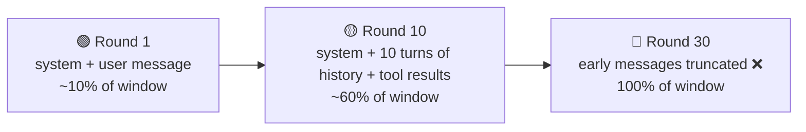
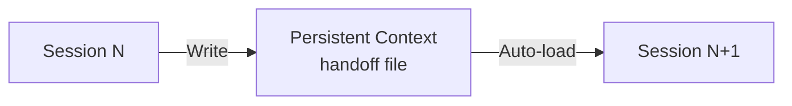
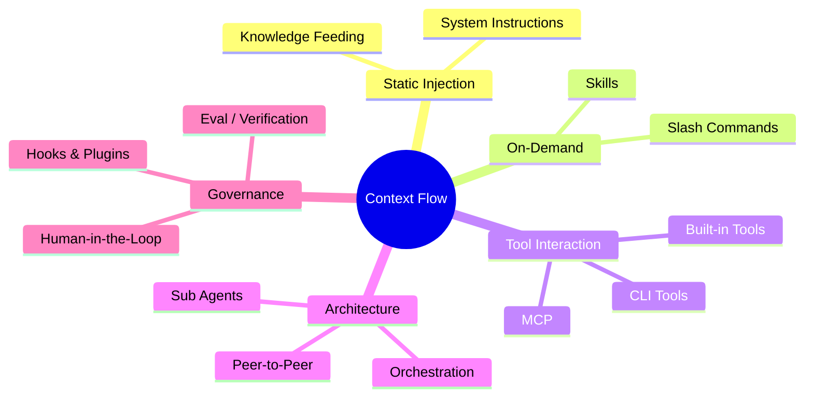

# Context — The First Principle

> **Context perspective:** Context itself is the first principle — an LLM's capabilities and limitations are entirely determined by its context.

## What Is Context

Everything you give the LLM is context.

Every piece of information the LLM sees when processing your request — system prompt, conversation history, tool definitions, tool results — all of it together, that's context.

Let's make this concrete: look at what happens under the hood.

### Requests and Responses: What Context Actually Looks Like

Communication between an agent and an LLM is HTTPS requests.

Not one request that does everything — it's **multiple round trips**, each a complete request → response cycle.

**── Round 1 ──**

The agent sends a POST to the LLM API. The `messages` array in the request body is the context:

```json
// → REQUEST (agent → LLM API)
{
  "system": "You are an experienced developer. Follow the project's coding standards...",
  "messages": [
    { "role": "user", "content": "Refactor processOrder, extract the validation logic" }
  ]
}
```

The LLM streams its response back via SSE (Server-Sent Events) — that character-by-character text appearing in your terminal is the SSE stream:

```json
// ← RESPONSE (LLM API → agent, SSE stream)
{
  "role": "assistant",
  "content": "Let me read the current implementation...",
  "tool_calls": [{ "name": "read_file",
                   "arguments": { "path": "src/processOrder.ts" } }]
}
```

Notice: the LLM didn't give a direct answer — it requested a tool call. The agent executes `read_file` **locally** and gets the file contents. This step doesn't go through the LLM API.

**── Round 2 ──**

The agent **appends** the previous LLM response and the tool result to the `messages` array, then sends the whole thing again:

```json
// → REQUEST (agent → LLM API — notice messages is longer than Round 1)
{
  "system": "You are an experienced developer. Follow the project's coding standards...",
  "messages": [
    { "role": "user",
      "content": "Refactor processOrder, extract the validation logic" },
    { "role": "assistant",
      "content": "Let me read the current implementation...",
      "tool_calls": [{ "name": "read_file", "arguments": "..." }] },
    { "role": "tool",
      "content": "export function processOrder(order) {\n  // 300 lines of tangled logic\n}" }
  ]
}
```

```json
// ← RESPONSE (LLM API → agent, SSE stream)
{
  "role": "assistant",
  "content": "Got it. The validation logic can be extracted into three functions..."
}
```

See it? Round 2's request **re-sends everything from Round 1** — the user message, the LLM's previous reply, the tool result.

**This is the essence of context accumulation: each round, the `messages` array grows, then gets re-sent in full.**

::: tip Different APIs, Same Essence
Anthropic's Messages API, OpenAI's Chat Completions API, Google's Gemini API — formats differ, but the core structure is identical: a message list, appended each turn, sent in full. Every agent tool you use is doing this under the hood.
:::

## Why It's the First Principle

**No memory.**

An LLM is not your coworker — it doesn't remember yesterday's design discussion. Even within the same conversation, it hasn't "remembered" what you said.

It simply **re-reads the entire message list from scratch** each time, then reasons.

This means every agent tool — regardless of vendor — does one core job:

> **Put the right information into context at the right time.**

Bottom line — your project rules file might be beautifully written, but if the agent didn't load it into context, it might as well not exist. Code that wasn't indexed gets guessed at. The quality of tool output directly determines the quality of the next step — garbage in, garbage out.

**Most of the frustrating problems you encounter** — generated code ignoring conventions, edits to wrong files, forgotten agreements — **are context problems at their root.** The model isn't stupid. It just didn't see what it needed to see.

Every mechanism covered in subsequent chapters — System Instructions, tools, MCP, Commands, Skills — **is fundamentally answering the same set of questions: what information to put in, when to put it in, and how to get it into context.**

## The Limits of Context

More context is not always better.

### The Window Is Finite

Every LLM has a context window limit. 128K, 200K tokens — sounds like a lot, but in agentic workflows it's consumed faster than you'd expect:

- System prompt + all tool definitions eat a large chunk upfront
- Complete conversation history accumulates with every turn
- Tool results (file contents, search results, command output) easily run thousands of tokens each

What happens when the window fills up? Earlier messages get truncated or compressed. The agent **literally forgets** what you discussed at the start — you think it still knows, but those messages are no longer in the `messages` array.



### Noise Drowns Signal

Stuffing an entire codebase into context is tempting, and disastrous.

Good context management means "retrieving the right few dozen key facts," not "dumping all text in at once." The goal is to **include only what the LLM actually needs to make its decision**—just enough, not one wasted sentence.

Hand an extremely smart stranger an entire filing cabinet and say "the relevant stuff is in there somewhere." They'll find some useful things, but they'll likely be misled by the noise too.

"Just enough" isn't a fixed bar. It depends on what you're asking the agent to do.

Understanding project structure or mapping module dependencies? Large context is fine. These tasks tolerate fuzziness; a wide view helps see the big picture.

Modifying a specific function or fixing a precise bug? Feed it only the files it needs. For precision edits, more information actually means less accuracy—the LLM's attention gets diluted by sheer volume, and it starts "borrowing" patterns from irrelevant files, copying the wrong variable name, or missing a constraint.

So working with agents actually has two distinct modes:

| Mode | Task Type | Context Strategy |
| :--- | :--- | :--- |
| **Understanding mode** | Mapping architecture, tracing dependencies | Open up — a wide view reveals the big picture |
| **Editing mode** | Changing a specific function, fixing a precise bug | Tighten — only give it the files it needs |

Switch between them based on the task at hand.

Context management boils down to four actions:

- **Write** — generate useful information
- **Select** — pick only what's relevant
- **Compress** — distill to the minimum necessary
- **Isolate** — give different tasks different context slices

Every tool and mechanism in subsequent chapters helps you do these four things.

### Context Pollution

In long conversations, context gradually gets "dirty." Early explorations, rejected approaches, wrong assumptions — no longer relevant, but still sitting in the message history, continuously influencing the LLM's judgment.

Bad context is worse than no context. With no context, the LLM knows it doesn't know and will at least say "I need more information." With stale or wrong context, it treats noise as fact and reasons confidently from false premises — you don't get "I'm not sure," you get an answer that looks plausible but is quietly wrong.

This explains a common phenomenon: the agent is fast and accurate early on, then starts making baffling mistakes later. The model didn't get dumber. The context got dirty.

A sneakier pollution: early wrong turns don't just take up space, they **keep pulling subsequent reasoning off course**.

A concrete scenario: in round 5, the LLM incorrectly decides to "manage state with global variables." Rounds 6 through 14, you keep working based on that decision — the code it generates, the refactors it suggests, the advice it gives all build on the "use globals" premise. In round 15, you spot the problem and say "don't use global variables, switch to dependency injection."

It briefly complies. But a few rounds later, it drifts back to globals.

Why? Look at what's in the `messages` array: your correction is just that one message in round 15. But rounds 5 through 14 — ten messages — while none of them explicitly repeat "use globals," their code, discussions, and decisions all **implicitly assume** that premise. When the LLM reads the message list from the top, ten messages pulling in one direction vs. one explicit correction pulling the other way — the inertia of the former far outweighs the latter.

```
// What's actually in the messages array
[
  msg 1-4:   Normal discussion
  msg 5:     ❌ LLM decides "use global variables"
  msg 6-14:  Code, refactors, advice built on that decision  ← 9 msgs implying the same premise
  msg 15:    ✅ You say "switch to dependency injection"      ← just this 1 msg
]
// 9 msgs of implicit direction vs. 1 explicit correction → inertia wins
```

What do you do when it's dirty?

Roll back to the last clean checkpoint. Throttle at the source—only feed the agent the files it needs for the current step, never "just in case."

The most effective move is starting a new session. But don't copy-paste the chat history. Distill what's worth keeping: confirmed facts, finalized decisions, acceptance criteria. Compress that into a clean input and carry only that forward. Leave the detours in the old session.

Addition decides what the agent sees. Subtraction decides what doesn't drown it.

One more actionable principle: put your most important constraints at the beginning and end of the conversation.

Models pay the least attention to the middle—researchers call this "lost-in-the-middle." Your core rules buried at message 50 will probably be ignored.

## State & Memory

Why does the agent "forget" things?

Because it has no memory at all. What it has is **session state** — the accumulated message list in the current conversation.

Your project rules file takes effect in every new conversation. Coding conventions get re-applied each time. That's not memory. That's **persistent context** — the agent proactively reads these files at the start of each new session, re-injecting them into the `messages` array. Looks like memory. It's a fresh reload every time.

| | Session State | Persistent Context |
|---|---|---|
| Lifetime | Disappears when conversation ends | Persists across sessions |
| Storage | Message list in memory | Files on the filesystem |
| Maintained by | Agent automatically | You lead, tools assist |
| Typical contents | Chat history, tool results | Project standards, architecture decisions, coding conventions |

For example: you ask the agent to read `package.json` during a conversation — that's session state, gone when the conversation ends. You write a `CLAUDE.md` in your project root specifying "all functions must have JSDoc comments" — that's persistent context, loaded by the agent at the start of every new conversation.

### Context Has a Shelf Life

Context has a shelf life — leave it too long and it spoils.

A session that's gone through hundreds of tool calls has almost certainly suffered context degradation. Early key information has been pushed to the edge of the window or truncated entirely, stale intermediate state has piled up in the middle, and later reasoning is built on a foundation of noise.

**When should you start a new conversation?** When the agent starts "forgetting" early agreements, repeating mistakes you've already corrected, or behaving erratically — the context has spoiled. Cut it off, start fresh, and let the agent begin from clean persistent context. That's far more efficient than fighting pollution in a degraded session.

### Session Handoff

Before ending a session, write key decisions, intermediate outputs, and next steps into persistent context — your project rules file, a handoff document, or anywhere the agent will read on next startup.

What's easiest to lose? Not "what changed" — git tracks that. What's easiest to lose is **"why you changed it."**

For example: you chose approach X over approach Y because Y had a race condition under high concurrency. That decision logic won't appear in the diff. The next session's agent can see what the code looks like, but not why it looks that way — so it might suggest switching back to approach Y.

So the core of handoff isn't "remembering." It's **explicit transfer**: writing the decision logic and context worth keeping into the initial input for the next session.



### Long-Term Memory

Session Handoff solves "this session to the next." But what about memory that stretches further?

Some Agent tools offer automatic cross-session memory. They accumulate key discoveries, preferences, and decisions across multiple sessions, retrieving relevant parts and injecting them into context on the next startup. This sounds like real memory.

But it isn't. It's just **automated persistent context**. Writing and retrieval are automatic, but the storage medium is still files or a database, and the injection timing is still at session start. The essence hasn't changed; the degree of automation has.

Two things to remember:

- **In-session** (session state) is short-term. It disappears when the conversation ends. Managed by you or automatically by the Agent.
- **Cross-session** (persistent context) is long-term. It relies on the filesystem or dedicated storage. Things you write (project rules, handoff files) or the Agent automatically accumulates (memory features) both fall into this category.

The second type sounds convenient, but there's a catch: you don't always see what gets auto-accumulated. The Agent remembers a decision that was later overturned. Much later, a new session gets a suggestion that looks reasonable but is actually based on stale memory. Stale memory is as dangerous as stale documentation. Arguably more so, because you might not even know that memory entry still exists.

## What's Next: Context Carriers in Subsequent Chapters

Context is the first principle. But "how to get information into context" has many different approaches, each suited to different scenarios.

Every subsequent chapter covers a different context carrier:

| Carrier | Role in Context |
|---|---|
| System Instructions | The first context the LLM receives, present by default |
| Built-in Tools | Tool definitions + return values = context |
| MCP | External capability extensions, also entering context |
| Slash Commands | On-demand context injection |
| Skills | Dynamically loaded domain knowledge |
| Agent-Native CLI Tools | External tool output becomes context directly |
| Knowledge Feeding | Turn what you know into what the agent knows |
| Orchestration Patterns | How context flows, forks, and merges across steps |
| Sub Agents | Creating fresh context (isolation) |
| Eval / Verification | Verification results = feedback context |
| Human-in-the-Loop | Humans determine context's final direction |
| Peer-to-Peer Agents | Context flows bidirectionally between peer agents |

One thread runs through it all: **how context flows.**



## Three Things to Watch in Every Chapter

- **Context flow:** This chapter's context starts with the system prompt. Every subsequent chapter adds more — different injection methods, but it all ends up in the `messages` array.
- **Risk:** Get the context boundary wrong and errors snowball — from this step to every step after it.
- **Auditability:** Good news — the complete `messages` array in each HTTP request is your log. Something went wrong? Replay from the start.

Next chapter breaks apart the three roles — you, the Agent, and the LLM — to see how context flows between them.
