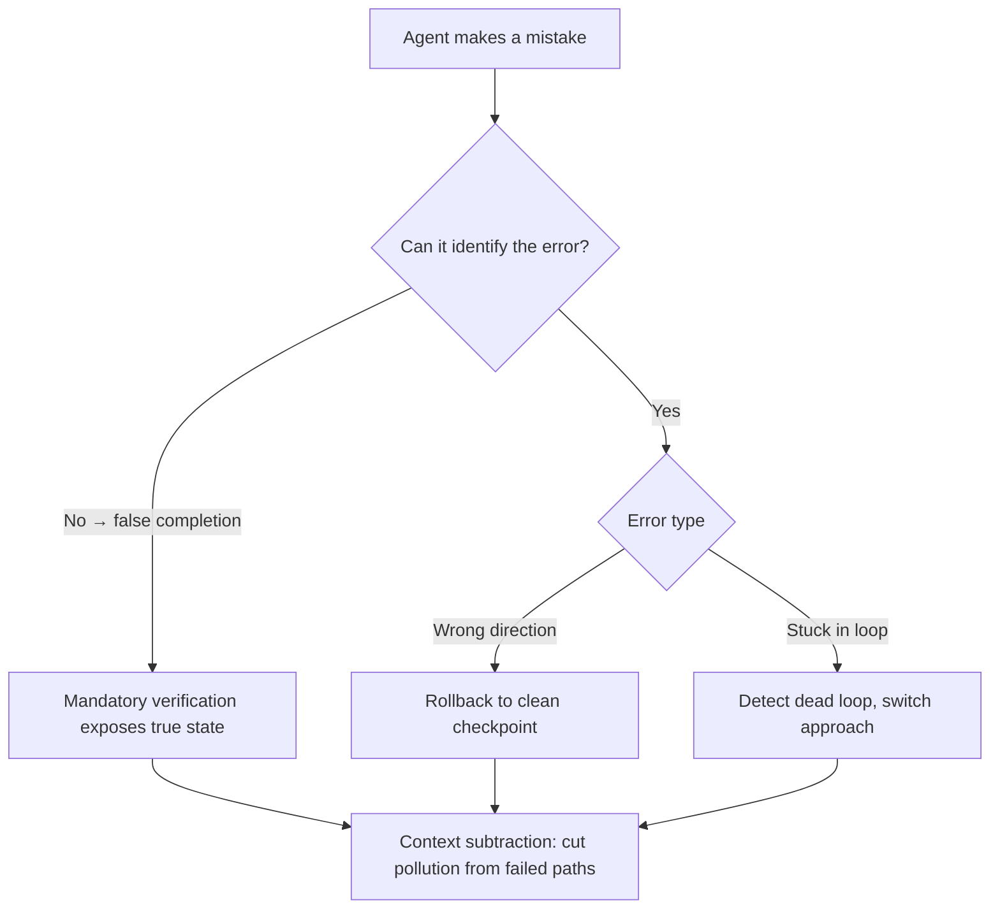

# Verification & Observability

> **Context Perspective**: Verification results are themselves context—exit codes, test reports, lint output all get injected back into messages, driving the Agent’s next decision.

The previous chapter established that a Sub Agent’s summary is compression, not truth. So how do you know it got things right?

Not just Sub Agents. Every output from an Agent—every tool call, every task result—could be wrong. Verification is the safety net.

## Step-by-Step Verification: From Commands to Tasks

Verification isn’t something you do at the end. It runs throughout every step of the Agent’s work, from fine-grained to coarse.

### Layer 1: Did the command succeed?

Every time the Agent calls a tool, the system automatically checks the result.

- **What’s verified**: A single tool call (`bash`, `read_file`, `write_file`…)
- **Success signal**: Exit code 0, file read successfully, API returns 200
- **On failure**: Error message injected back into context; Agent adjusts automatically

```json
// → REQUEST (Agent decides to call a tool)
{
  "role": "assistant",
  "tool_calls": [{ "name": "bash", "arguments": { "command": "npm install" } }]
}

// ← RESPONSE (Tool result injected into next context round)
{
  "role": "tool",
  "name": "bash",
  "content": "exit code: 1\nnpm: command not found"
}
```

The LLM sees this `tool` message in the next turn, knows `npm install` failed—`npm` not found—and decides to try `bun install` instead.

This layer is fully automatic. You don’t need to be involved. But it’s the foundation of the entire verification stack: if signals from this layer don’t get properly injected into context, everything above it breaks.

### Layer 2: Is the task actually done?

A successful command ≠ a completed task.

`edit_file` succeeding doesn’t mean the refactor is correct—you need to run the tests. `bash deploy.sh` returning exit code 0 doesn’t mean the deployment worked—you need to hit the URL and check for a 200.

- **What’s verified**: The completed task’s actual intent
- **Success signal**: Real-world external standards (tests pass, build succeeds, API reachable)
- **On failure**: Failure signal injected into context; Agent enters a correction loop (the iterative pattern from the previous chapter)

The key point: **task-level pass/fail must also be injected back into context.**

If the Agent runs tests but can’t see the results, it can’t judge whether the task is truly done.

```json
// Agent ran the tests; result injected into messages
{
  "role": "tool",
  "name": "bash",
  "content": "exit code: 1\nFAILED tests/auth.test.ts > should reject expired tokens\nExpected: 401, Received: 200"
}
```

The Agent sees this message, realizes the refactor broke expired token validation, and targets the fix.

As the user, your job is to **define what "done" means**:
- Which test command to run (`bun test`, `pytest`)
- Which lint check to run (`eslint .`, `tsc --noEmit`)
- What file state to verify

The clearer your definition of "done," the stronger the Agent’s self-verification capability.

### Layer 3: Is the system reliable overall?

The first two layers focus on individual tasks. Layer 3 steps back to look at the big picture.

After using an Agent for a while, you start asking:
- How many tokens did that task burn? Is it too expensive?
- On average, how many tool-call rounds does the Agent need for this type of task? Getting better or worse?
- Is it flip-flopping between two approaches?

This is observability—continuous monitoring of the Agent’s behavioral patterns.

- **What’s verified**: Long-term behavioral patterns and resource consumption
- **Success signal**: Completion rate rising, average steps declining, token cost reasonable
- **Triggered action**: On anomaly—downgrade strategy, pause task, or escalate to human

Structure verification as a pyramid. Lower levels automate; the top requires humans.


### Level 1: Syntax and execution
Agent checks automatically. Does it run? Do commands error out?

The trap: **no error ≠ success.** `rm` deleting the wrong file throws no error. A script with flawed logic still runs.

### Level 2: Logic and semantics
Tests check. Is the functionality correct? Are edge cases handled?

Watch one thing: did the Agent fix the **root cause** or just the **symptom**? Some Agents delete a test case or increase a timeout to make tests pass.

### Level 3: Intent and value
Human checks. Is this actually what I wanted?

This layer can't be automated. An Agent perfectly implementing a feature you don't need is still a failure.

## Error Recovery

Agents make mistakes. What matters is whether they can pick themselves back up.

A counterintuitive finding: **don't rush to erase errors.** Failed attempts left in context actually help the LLM avoid repeating the same mistake—it implicitly learns "that path doesn't work" from the failure record. Blindly pruning conversation history can backfire because you're wiping out valuable negative experience alongside the noise.

This doesn't mean never clean up—context windows are finite. The key is distinguishing "stale noise" from "failure records that still inform."


**Rollback**: When task-level verification fails, return to the last known good state. Say a code refactor breaks the tests—the Agent uses `git checkout` to undo the changes and tries a different approach. The key is establishing a rollback point before making changes. Good Agents check that git status is clean before starting major edits.

**Stuck loop detection**: If the Agent keeps trying the same approach but keeps failing (hitting the retry threshold), it should stop and switch strategies instead of continuing to hit the wall. When you see the Agent say "I seem to be stuck"—that’s a good sign. It recognized the loop.

**False completion**: The trickiest failure mode. The Agent says "Done!" but task-level verification shows failure. Usually because the verification step wasn’t enforced—the Agent skipped tests and declared victory. The fix: make verification mandatory in your instructions ("After editing, you must run `bun test`. All tests passing = done"), ensuring the result gets injected back into context.



Rollback, rerouting, forced reruns—these recovery moves all boil down to context subtraction: cutting the pollution of failed paths from conversation history.

But there's a subtler subtraction you might not notice: in long conversations, agents automatically compress early history to prevent window overflow. The cost? Your original constraints may get compressed away. If an agent suddenly "forgets" initial rules late in a conversation, it's probably not stupidity—that rule simply isn't in the context anymore. In practice: periodically restate core constraints during long tasks. Or when it errs, send the original instruction alongside its mistake and let it compare.

### Recovery Strategy: Rollback, Fix, or Start Over

The Agent messed up. What's the next move? Not every error warrants the same response.

| Situation | Recommendation | Rationale |
|-----------|---------------|-----------|
| Small scope, clear error | Fix in place | Fastest; context is still warm |
| Large scope, right direction but wrong details | Partial rollback + fix | Keep the correct parts, undo only what's broken |
| The entire direction was wrong | Start over (new session) | Continued patching only makes it worse |

Which path to choose depends on one judgment: **what layer is the error on?** A tool call had the wrong parameter? One-line fix. The entire approach was misguided? A hundred-line fix won't save it—start fresh, and feed the failed attempt as "negative experience" into the new session.

### The Verification Loop

Verification isn't "run the tests when you're done." It's a cycle: execute → verify → feedback → correct → verify again.

The key to closing the loop is **feedback injection**. The Agent runs tests; the results must return to the context—pass means proceed, fail means identify the problem. If verification results don't get injected back, the Agent is walking blind.

A complete verification loop:
1. Agent completes a modification
2. Verification triggers automatically (tests, build, lint)
3. Results inject back into context
4. Agent decides based on results: pass → continue, fail → fix
5. After fixing, return to step 2

Your job is to keep step 3 intact. Tests ran but results weren't fed back? That's the same as not testing at all.

## Common Anti-Patterns


### False Completion

**Symptom**: The Agent announces "Done!" but you find the feature wasn't implemented, tests weren't run, or they ran but failed.

**Consequence**: You assume the task is complete and build subsequent work on that assumption. When the issue surfaces, downstream tasks need rework too.

**Fix**: Make verification a mandatory step in your instructions—"After editing, you must run `bun test`. All tests passing = done." The key is getting verification results into the context rather than letting the Agent "judge" completion on its own. External signals (exit codes) are far more reliable than the Agent's self-assessment.

### Stuck Loop

**Symptom**: The Agent keeps trying the same fix repeatedly, failing each time, but never switches approach. You see the same error appearing three or four times in the conversation.

**Consequence**: Burns tokens and time, ultimately still fails. Worse, conversation history gets polluted with identical failure records, filling the context window with useless content.

**Fix**: Set a retry threshold—"If the same approach fails twice, try a different strategy." Or more directly: when you spot a stuck loop, intervene and tell the Agent to stop trying, then give it a new direction. Some Agents will self-identify loops and report "I seem to be stuck"—this is actually good behavior, far better than silently hitting the wall.

### The Speed Trap

**Symptom**: The Agent generates code blazingly fast, but quality is declining—sloppy variable names, unhandled edge cases, style inconsistent with the project.

**Consequence**: Looks efficient short-term; doubles maintenance costs long-term. The time you spend reviewing and patching may exceed what manual coding would have taken.

**Fix**: Verification density must keep up with generation speed. Agent modified code? Immediately run tests, lint, type checking. For things automated verification can't catch (naming, design intent, architectural consistency), do manual reviews at key checkpoints. Not every time—but spot-check every few tasks.

## Key Takeaways

- **Context flow**: Each verification layer produces signals (exit codes, test reports, metrics) that get injected back into context, becoming the basis for the Agent’s next decision. Verification isn’t a post-mortem—it’s real-time navigation.
- **Risk**: Insufficient verification is the root cause of runaway Agent projects. A small tool-level error, if not caught early, gets amplified through subsequent steps—leading to catastrophic task failure.
- **Auditability**: Logs from all three verification layers form a complete audit chain. Tool call inputs/outputs, task verification pass/fail records, observability metrics—these let you trace what the Agent saw, what it did, and why, at every decision point.

Next up: Human-in-the-Loop. Verification tells you whether things are right or wrong. When the answer is "wrong" and the operation is irreversible—it’s time for a human to step in.
