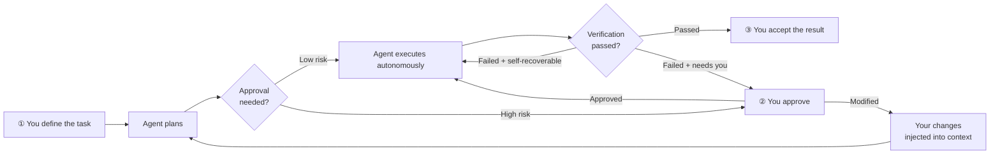
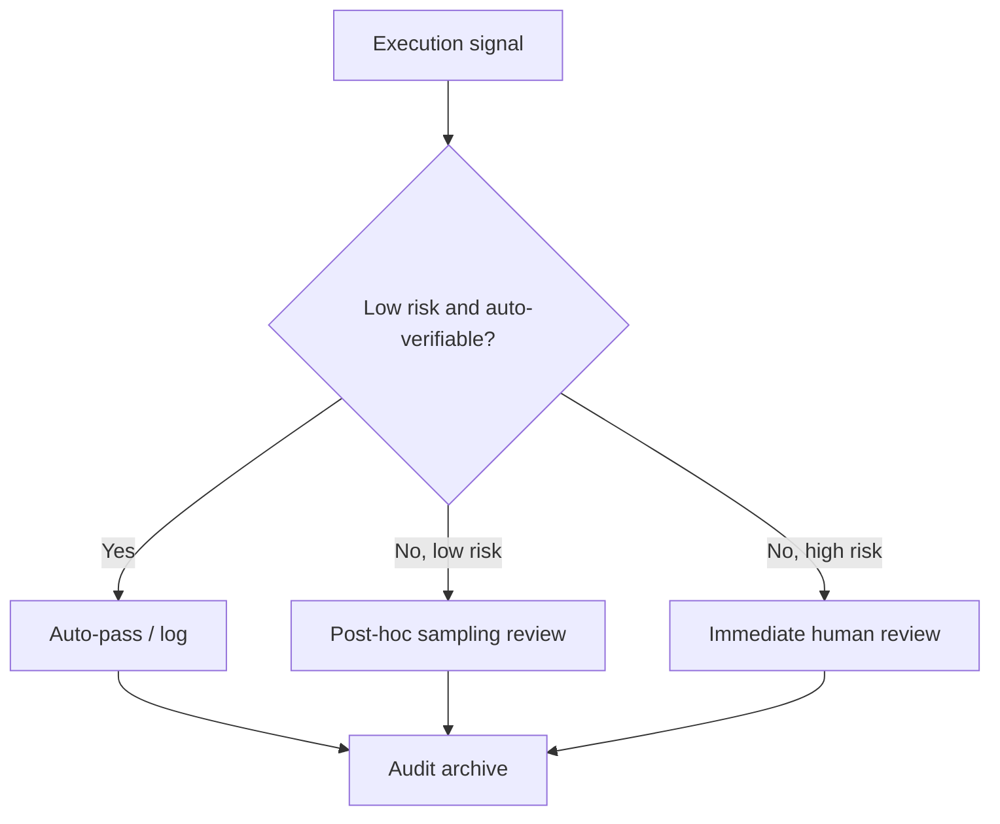

# Human-in-the-Loop: You Are the Final Decision-Maker

> **Context Perspective**: Every time you approve, reject, or modify, you rewrite the next round of context and change the Agent's behavior. You're not just reviewing—you're shaping the Agent's decision path.

Agents can judge many things right from wrong on their own—did the test pass, did the build succeed, was the exit code normal? But some things the machine can't judge: Should this go to production? Is this refactoring direction correct? Is deleting this data actually safe?

Those calls are yours to make.

## An Ideal and a Reality

The ideal: you express intent, the Agent does everything, you accept the result. Zero intervention in between.

The reality: Agents make mistakes, get stuck, and need your confirmation before high-risk operations. Your intervention is the safety net.

But here's an important insight: **if you find yourself constantly fixing the Agent's half-finished work, that's not "collaboration"—that's the Agent (or your instructions) failing.** Healthy Human-in-the-Loop means your interventions decrease over time, not increase. Each intervention should be a signal: either improve the Agent's configuration (better System Instructions, clearer prompts) or accept the current capability boundary.

<SvgIllustration name="human-in-the-loop.svg" interactive />

## Paving the Rails

If you feel exhausted, it's probably because you treat the agent like a self-driving car but keep your hands on the wheel.

A more relaxed mode exists: **pave the rails, then run the train.**

You do the structural, high-context work: project skeletons, test cases, API interfaces. The agent does the laborious, low-context work: filling in blanks, implementing functions, passing tests.

The rails limit how far the train can go off track. Your test cases are the guardrails.

## Your Three Positions in the Flow

1. **Input: Define the task.** You provide the intent, the background, and what "done" means. This is your first injection into the context—instruction quality determines everything downstream.

2. **Middle: Critical decision points.** The Agent pauses at high-risk operations and waits for your call. Your decision (approve / modify / reject) gets injected back into context, rewriting the Agent's next move.

3. **Output: Accept the result.** The Agent says "done." You confirm whether it actually is. For low-risk tasks, you can skip this; for high-risk ones, it's the final gate.

The pattern at every position is the same: **your decision → context changes → Agent behavior changes.**

Four things most worth your personal attention:

- **The Agent's execution plan**—what it plans to do, in what order. If the direction is wrong, everything downstream is wasted.
- **Test case design**—what scenarios did the Agent's tests cover? What edge cases were missed? Test cases define what "done" means.
- **Design decisions in the implementation**—what architecture, how modules are split, which dependencies are chosen. Once these decisions land, the cost of changing them is high.
- **Correctness of the final result**—not "tests passed," but "this is actually what I wanted."

## Letting Go vs. Stepping In

Not every task needs your attention. The criterion isn't gut feeling—it's risk assessment.

| Risk Level | Task Characteristics | Your Strategy | Examples |
|:---|---|---|---|
| **Low / Reversible** | Small blast radius, easy rollback, low verification cost | **Let go** | Generate unit tests, refactor pure functions, draft docs |
| **Medium / Controllable** | Multiple files involved, version-controlled | **Spot-check** | Add a feature, modify an API, upgrade dependencies |
| **High / Irreversible** | Production environment, data deletion, public release | **Mandatory approval** | Database migration, `git push --force`, deploy to production |

Three hard triggers—regardless of how much you trust the Agent, these operations **must** get human confirmation:

- **External writes**: `git push`, publishing npm packages, deploying websites
- **Irreversible operations**: Deleting files, `git reset --hard`, wiping databases
- **High-cost operations**: Expensive API calls, large-scale CI/CD pipelines

Some Agent tools automatically pause before these operations and show a diff. If yours doesn't, write it into your System Instructions: "You must request confirmation before executing the following operations."

## Course-Correction Strategies

When the Agent goes off track, you have three paths:

| Strategy | When to use | Rationale |
| :--- | :--- | :--- |
| **Interrupt immediately** | Agent misunderstood your intent from the start, or is executing something clearly wrong | The earlier you interrupt, the lower the sunk cost |
| **Let it finish, then revise** | Overall direction is right, but details are off | Preserves most of the Agent's work; you only fix details |
| **Abandon and start fresh** | Context is severely polluted; Agent is stuck in an unrecoverable mess | Clean session + clear instructions > struggling in the mud |

How to choose? Ask yourself: is the expected return of continuing greater than the cost of starting over?

## Cognitive Debt

A hidden but serious risk: **over-delegation erodes your understanding of the system.**

The Agent writes the code, fixes the bugs, adjusts the architecture—a few months later, you might not be able to explain how certain modules work. This isn't technical debt. It's **cognitive debt**. The liability isn't in the code—it's in your brain.

How to tell if you're accumulating cognitive debt? A few symptoms:

- Someone asks how a module works, and you need the Agent to explain it to you
- Your code review time keeps shrinking—because you can't really follow the code anymore, so you just trust the Agent
- When something breaks, your first instinct isn't to debug it yourself, but to ask the Agent to diagnose

This gets worse in teams. Each person delegates different modules to their own Agent. After a while, it becomes hard for anyone to explain the full picture of the system. The code isn't lost—it's all in git. What's lost is the team's shared understanding of the codebase.

Mitigation:

- **Seriously review the Agent's commits**—the same way you'd review a colleague's code
- **Write core modules yourself**, or pair-program with the Agent
- **Regularly draw architecture diagrams**—the Agent can generate them, but you must understand and confirm them

An Agent helps you do more. But if your understanding of the codebase falls behind, you won't be able to catch problems in its output.

Speed doesn't equal quality. As Agent output gets faster, you unconsciously lower your acceptance bar. Code that runs gets merged, long diffs get skipped, passing tests mean "done"—until one day you realize the codebase has accumulated a pile of "runs but isn't right" logic.

The fix is simple: set yourself a checkpoint, even if it takes just two minutes—open the diff, look at the three most critical files, confirm the changes match your intent. You don't need line-by-line review, but the direction can't drift.

<SvgIllustration name="human-in-the-loop-inline-1.svg" interactive />

There's an equally dangerous slide in the opposite direction: approval fatigue. The Agent pauses for your confirmation before every high-risk operation. When confirmations pop up repeatedly, your attention gives out before your willingness does—you go from "carefully reviewing the diff" to "reflexively clicking approve." The fix mirrors the "Letting Go vs. Stepping In" section above: don't prompt for low-risk ops. Save your approval budget for decisions that genuinely need your judgment.

## Closing the Approval Loop: Attention Budgets and Cognitive Engagement

Too many approvals is usually just the symptom. What actually drains people is low-value approvals: things the machine could decide, log, and replay—yet still demands a human click.

Most actionable completion signals don't need a human present: tests pass, build succeeds, lint is clean, exit code is zero. These can be verified and logged automatically. The archive should at minimum include the check, the result, the timestamp, the triggering task, and the corresponding commit or run id.

The cases that warrant human presence usually fall into three buckets: the operation is irreversible (deleting data, pushing to production); the decision involves organizational judgment; or an anomaly signal exceeds a preset threshold and needs human classification.

Organizational judgment isn't something the model can decide for you by thinking harder. Examples: whether the release window collides with a business event, whether breaking interface compatibility needs to be announced to downstream teams in advance, whether a security exception is acceptable, or whether this change shifts behavior the team has already promised. Everything else, low-risk by nature, can usually be handled by post-hoc sampling review.

Separating those three layers turns the approval policy into a funnel:

The goal isn't to press fewer buttons; it's to make every remaining press worth pressing. Once approval frequency drops, you actually have room to judge carefully, instead of sliding into reflex.

There's a consequence worth keeping in mind, though. If you spend a long time looking only at high-risk nodes and ignore everything the funnel auto-passes, your understanding of the system tends to stay at the "anomaly detection" level. By the time the funnel configuration itself goes wrong—what counts as high risk, whether the thresholds are right—you'll find it harder and harder to read why the funnel routes things the way it does.

That's why sampling reviews aren't a formality. Every so often, sample by risk tier and look at a handful of auto-passed records; also pull the records that were auto-passed but later turned out to be problems. That's how you confirm the funnel is filtering the right things. It's a check on current decision quality, and it's maintenance on your own judgment. You have to keep understanding this system well enough to notice and fix it when the funnel fails.

Human attention is finite. The point of an approval policy is to spend that finite attention on the decisions the machine genuinely can't make.

## Key Takeaways

- **Context flow**: Every decision you make (approve, reject, modify) is a context injection. The Agent's output is your input for decision-making; your decision is the Agent's input for its next reasoning round. This is the only bidirectional closed loop in the entire tutorial—human and Agent are each other's context.
- **Risk**: Danger in both directions. Over-trust leads to cognitive debt accumulation and loss of control; approval fatigue means you rubber-stamp the Agent's requests without thinking—no different from not reviewing at all.
- **Auditability**: Every intervention you make—what you approved, rejected, changed—should be logged. This isn't just for tracing issues; it's your data source for reviewing whether your collaboration model with the Agent is healthy.

Next is the final stop: Peer-to-Peer Agents. Until now, the human has always been the ultimate arbiter of context. But when multiple Agents start collaborating as peers, context flow gets more complex.
