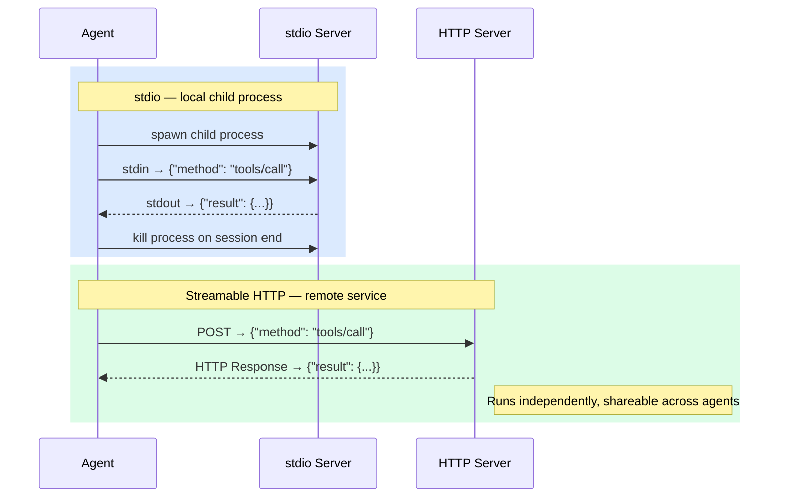
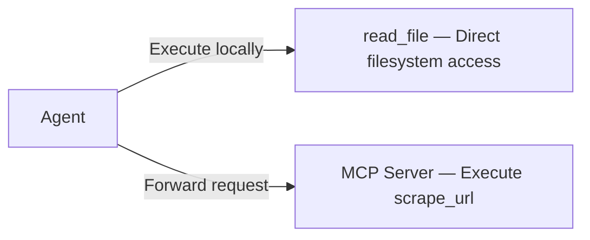

# MCP — External Capabilities

> **Context Perspective**: The definitions and return values of MCP tools enter the context just like built-in tools. The LLM does not distinguish their origins.

The previous chapter's built-in tools all execute locally — reading files, running commands, the agent handles it directly. But what if you want the agent to scrape a webpage, query Slack messages, or call a company-internal API?

Wait for the agent developer to add it? Impractical. Modify the agent's source code yourself? Even less realistic.

You need a standard interface that lets **any external capability** plug into the agent. That's MCP (Model Context Protocol).

<SvgIllustration name="mcp.svg" interactive />

## What is MCP?

One sentence: **the USB port of the agent world.**

MCP is an open protocol. It defines a standard that allows anyone to develop tools for an agent without modifying the agent's own code. Just as a USB device doesn't need to understand a computer's internals, an MCP tool doesn't need to know the agent's implementation details.

The agent loads these pre-configured external tools at runtime. You just configure it — no code required.

<SvgIllustration name="mcp-inline-1.svg" interactive />

## Server and Client

These two terms trip people up. Let's clear up a common misconception: **an MCP Server is not necessarily a remote server.**

- **MCP Client**: A component running inside the agent, responsible for discovering, connecting to, and calling tools on MCP Servers. You typically don't interact with it directly.
- **MCP Server**: The party that provides tools. It can be a local process or a remote HTTP service.

You'll encounter all kinds of MCP Servers. Some real examples: Context7 (documentation lookup), Tavily/Exa (search engines), DeepWiki (repository documentation), Firecrawl (web scraping), Grep.app (GitHub code search). Some run locally on your machine via stdio (like Context7, Firecrawl), others run as remote HTTP services (like Exa, DeepWiki, Tavily).

### Two Transport Modes

MCP supports two ways to connect to a Server:

**stdio (local child process)**: The agent spawns a child process to run the MCP Server. Communication goes through stdin/stdout, and the agent manages the process's entire lifecycle — startup, communication, shutdown. When you write `command: "npx", args: ["-y", "@upstash/context7-mcp"]` in your config to connect to the Context7 documentation lookup service, this is the mechanism behind it.

**Streamable HTTP (remote service)**: The MCP Server runs as an independent HTTP service, and the agent connects via HTTP requests. Suited for scenarios requiring persistent uptime or shared access across multiple agents.

For you, the difference is just configuration. For the LLM, it doesn't know and doesn't care.

A side-by-side comparison of how both transport modes work:



## Functionally Equivalent, Different Origin

Here's the key: to the LLM, built-in tools and MCP tools are **indistinguishable**.

**── Round 1 ──**

Say we have a `scrape_url` tool accessed via MCP. When the user asks a question, the agent places **all available tools** (built-in + MCP) into the context together:

```json
// → REQUEST (agent → LLM API)
{
  "system": "You are a project assistant...",
  "tools": [
    {
      "name": "read_file",
      "description": "Reads the content of a file",
      "input_schema": { "...": "..." }
    },
    {
      "name": "scrape_url",
      "description": "Scrapes the content of a URL and returns markdown",
      "input_schema": { "...": "..." }
    }
  ],
  "messages": [{ "role": "user", "content": "What does the page at https://example.com/docs/api say?" }]
}
```

The LLM picks the most appropriate tool:

```json
// ← RESPONSE (LLM API → agent, SSE stream)
{
  "role": "assistant",
  "content": "Okay, scraping the page...",
  "tool_calls": [
    { "id": "call_xyz789", "name": "scrape_url", "arguments": { "url": "https://example.com/docs/api" } }
  ]
}
```

LLM's perspective: identical to calling `read_file` — just a `tool_calls` response.

Agent's perspective: different execution path.



**── Round 2 ──**

After the MCP Server returns results, the agent wraps them into a `tool`-role message and appends to the conversation history. Same format as built-in tool results:

```json
// → REQUEST (agent → LLM API)
{
  "messages": [
    // ... previous messages
    {
      "role": "tool",
      "tool_call_id": "call_xyz789",
      "content": "# API Reference\n\n## Authentication\nAll requests require a Bearer token...\n\n## Endpoints\n- GET /users — List all users\n- POST /users — Create a new user\n..."
    }
  ]
}
```

```json
// ← RESPONSE (LLM API → agent, SSE stream)
{
  "role": "assistant",
  "content": "This page is API documentation. Key points:\n1. Authentication: Bearer token required\n2. Two endpoints: GET /users (list users) and POST /users (create user)\n\nWant me to dig into a specific endpoint?"
}
```

The LLM only cares that it got the page content. It doesn't know or need to know whether they came from the local machine or a remote server.

One-line summary: **LLM layer — fully equivalent. Agent execution layer — different paths.**

<SvgIllustration name="mcp-inline-2.svg" interactive />

But flexibility has a hidden cost. Each connected MCP Server injects all of its tool definitions into every request. Enable ten Servers at once, and dozens of tool definitions permanently occupy the context window—squeezing out space for your instructions, conversation history, and tool return values. In practice: create different MCP profiles for different task types—one set for coding, another for data work. The principle: off by default, on when needed.

## Why It Matters

MCP's value isn't "yet another protocol." Its value is **freeing you from depending on the agent developer**:

- **Don't wait for updates**: Want a search engine integration? Install an MCP Server. No need to wait for the next agent release.
- **Connect internal systems**: Your company's internal API will most likely never get official agent support, but you can write (or find) an MCP Server for it.
- **Reuse across agents**: An MCP Server can theoretically be used by any agent that supports the protocol — not locked to a specific tool.

## Key Takeaways

- **Context flow**: MCP tool definitions are injected into every request (static); return values are appended after execution (dynamic). They travel the same context pipeline as built-in tools — the LLM perceives no difference.
- **Risk**: MCP's trust problem is sharper than built-in tools. A malicious MCP Server could return false data to pollute your context, or log your sensitive requests. Installing an MCP Server is like installing a browser extension — is the source trustworthy? Are the permissions reasonable?
- **Auditability**: Every interaction between the agent and MCP Server should be logged — what was requested, what was returned, how long it took. When something goes wrong, this is your investigation trail.

Next chapter: Slash Commands — how to package common operations into one-click shortcuts.

