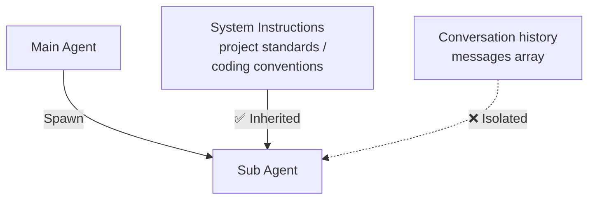

# Sub Agents — Context Isolation

> **Context Perspective**: A Sub Agent creates an isolated context to tackle a specific sub-task, preventing contamination of the main context.

The previous chapter covered orchestration patterns—how to organize steps. This chapter looks at the execution unit: when the main Agent needs a clean environment for a sub-task, it spawns a Sub Agent.

<SvgIllustration name="sub-agents.svg" interactive />

## The Problem: Context Gets Dirty

Remember "context pollution" from [The First Principle](./context.md)?

The longer a conversation goes, the longer the `messages` array gets. Early explorations, rejected solutions, irrelevant tool outputs… all piling up. When you ask the Agent to perform a precise sub-task in this noise—say, "write an integration test based on the latest API schema"—the LLM’s attention gets diluted. It might reference outdated code or follow a deprecated convention.

You need a clean room.

That said — not every task needs one. A single [Command](./commands.md) trigger enough? Use that — simpler. A [Skill](./skills.md) loads once and stays active. Sub-task is independent with a clear goal? Spawn a Sub Agent right away — no need to wait until the context gets noisy.

## Spawning a Sub Agent

A Sub Agent is that clean room.

The main Agent can spawn one or more Sub Agents. Each Sub Agent’s `messages` history **starts from zero**—it can’t see what the main Agent discussed with you. But "clean" doesn’t mean "blank": Sub Agents typically inherit the main Agent’s System Instructions. The project standards, coding conventions, and safety rails you wrote in CLAUDE.md—the Sub Agent follows those too.

What’s isolated is the conversation history, not the project rules.



One more thing that’s easy to miss: **the Sub Agent’s initial prompt is usually constructed by the main Agent automatically.** You give the main Agent a big task. The main Agent analyzes it, decides "this sub-task needs isolated handling," and constructs an initial prompt for the Sub Agent. You can guide this through System Instructions—for example, "when delegating, always include file paths and constraints." The more precise your instructions, the better the prompt it constructs.

## What a Good Initial Prompt Looks Like

The most common mistake when delegating to a Sub Agent is dumping the entire chat history.

The right approach — a focused task description with just three things:

1.  **Goal:** Be specific. "Fix the login bug in the auth module."
2.  **Constraints:** State the boundaries. "Do not touch the DB schema. Do not add new dependencies."
3.  **Key Context:** Provide only what's necessary. "Relevant files are A and B. Error logs are in C."

Dumping context is lazy. The Sub Agent will get lost in the noise.

<SvgIllustration name="sub-agents-inline-1.svg" interactive />

## How It Works

The main Agent delegating to a Sub Agent boils down to three steps:

<SvgIllustration name="sub-agents-inline-3.svg" interactive />

**── Inside the Sub Agent ──**

The Sub Agent’s `messages` start from zero, but its system prompt inherits the project’s System Instructions:

**Round 1: Receiving the task**

```json
// → REQUEST (Sub Agent → LLM API)
{
  "system": "You are a code assistant.\n\n[Project System Instructions]\n- TypeScript strict mode\n- Tests use Vitest\n- No any types\n...",
  "messages": [
    { "role": "user", "content": "You are a QA Engineer. Here is the API schema: {...}\nWrite an integration test for createUser..." }
  ]
}
```

Notice `messages` has exactly one entry—clean, focused, no baggage from the main Agent’s history.

**Round 2: Context grows after tool calls**

The Sub Agent reads the schema, writes a test file, runs the test, sees a failure, and corrects:

```json
// → REQUEST (Sub Agent → LLM API, Round 2)
{
  "system": "(same as above, unchanged)",
  "messages": [
    { "role": "user", "content": "You are a QA Engineer..." },
    { "role": "assistant", "content": "Let me read the schema first...", "tool_calls": [{ "name": "read_file", "arguments": {"path": "src/api/v2/schema.json"} }] },
    { "role": "tool", "content": "{ \"endpoints\": { \"createUser\": { ... } } }" },
    { "role": "assistant", "content": "Schema loaded. Writing the test...", "tool_calls": [{ "name": "write_file", "arguments": {"path": "tests/integration/createUser.test.ts", "content": "..."} }] },
    { "role": "tool", "content": "File written." },
    { "role": "assistant", "content": "Running the test to verify...", "tool_calls": [{ "name": "bash", "arguments": {"command": "vitest run createUser"} }] },
    { "role": "tool", "content": "FAIL: expected 201 but got 500..." },
    { "role": "assistant", "content": "Test failed with 500. Checking the endpoint implementation—missing DB connection config. Fixing the test mock..." }
  ]
}
```

The Sub Agent might go through a dozen rounds of tool calls internally—reading specs, writing code, running tests, fixing bugs. **All of this happens in the isolated context. The main Agent can’t see it and isn’t disturbed by it.**

**The Final Return**

When the Sub Agent finishes, it returns a **summary** to the main Agent—not dozens of raw messages, but a compressed result. Think of it like `git stash`: stash your current complex context, do an atomic task on a clean branch, then switch back with the output.

<SvgIllustration name="sub-agents-inline-4.svg" interactive />

What the main Agent receives is just: "Tests created, covering 201 and 400, file at `tests/integration/createUser.test.ts`." Whatever struggles the Sub Agent went through in between—the main Agent doesn’t need to know.

<SvgIllustration name="sub-agents-inline-2.svg" interactive />

## Connecting Back to the First Principle

A Sub Agent’s performance depends on two things:

1. **The quality of System Instructions**: The project rules you wrote in CLAUDE.md—the Sub Agent consumes those too. Good rules mean the Sub Agent’s behavior aligns with project standards. This is the [knowledge feeding](./knowledge-feeding.md) rule layer at work inside Sub Agents.

2. **The quality of the initial prompt the main Agent constructs**: This loops back to [The First Principle](./context.md)—context quality determines output quality. A good initial prompt must be:
   - **Self-contained**: Not reliant on hidden information from the parent context.
   - **Complete**: Including all necessary background materials (code snippets, file paths, clear objectives).
   - **Focused**: Only information relevant to the sub-task, no noise.

What you can do: give the main Agent clear instructions and sufficient background. The better the raw material the main Agent has, the better the prompt it constructs for the Sub Agent.

## Key Takeaways

- **Context flow**: The main Agent extracts information from its own context to construct the initial prompt → Sub Agent executes independently in isolated context → returns a summary that gets injected back into the main Agent’s context. Runtime isolation and full logging coexist—they don’t conflict.
- **Risk**: Isolation is a double-edged sword. If the main Agent omits a key constraint when constructing the prompt, the Sub Agent works without critical information and may produce non-compliant code. Over-splitting also has costs—each Sub Agent needs to rebuild context from scratch, and coordination overhead accumulates.
- **Auditability**: Each Sub Agent’s full session log is saved independently and can be traced. When a summary looks wrong, you can drill down into the Sub Agent’s complete context to investigate. A summary is compression, not truth—the next chapter covers how to verify.

Next up: verification and observability. Is the summary a Sub Agent returned actually reliable? Every output from an Agent needs a verification mechanism as a safety net.

