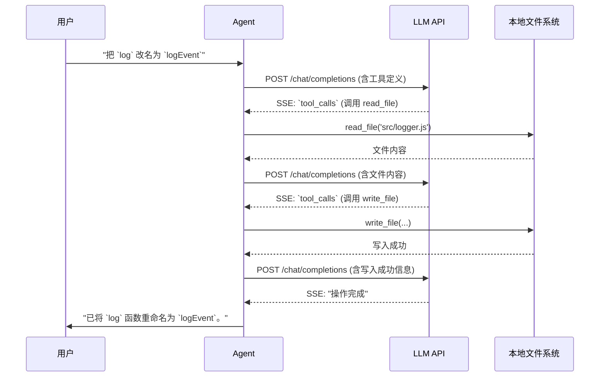

# 内置工具

> **上下文视角**：工具定义是 LLM 行动的说明书，工具返回值是它感知世界的方式。两者共同构成关键上下文。

上一节讲了系统指令如何定义 LLM 的行为基准。但光有身份不够——LLM 还需要**行动能力**。

内置工具就是这种能力。它们是 Agent 开发者预先编写的函数——读文件、执行命令、搜代码、访问网络——集成在 Agent 内部，由 Agent 在你的本地机器上执行。

其中 `bash`（或 `shell`）是最万能的一个。理论上它能做任何事——读文件、装依赖、跑测试、查 Git 历史、curl 一个 API。那为什么还需要其他工具？因为专用工具更安全、更精确：`read_file` 比 `cat` 更可控，`edit_file` 比手动拼接文件内容更不容易出错。

LLM 自己不能运行这些函数。它能做的是生成一个 JSON 对象，告诉 Agent "帮我执行这个操作"。

这个操作就是一次工具调用（tool call）。

Agent 在本地执行工具，然后把执行结果——成功或失败，连同输出——打包成新的消息，追加到对话历史里，再发给 LLM。LLM 看到结果，决定下一步是再次调用工具，还是回答用户问题。

这个"生成工具调用 → 本地执行 → 返回结果 → 基于结果再推理"的闭环，就是 agentic 工作流的核心。

<SvgIllustration name="built-in-tools.svg" interactive />

## 工具调用流程

让我们通过一个完整的 HTTP 请求/响应流程，看看这个引擎怎么转。

假设你对 Agent 说："把 `logger.js` 里的 `log` 函数改名为 `logEvent`。"

**── 第 1 轮：从意图到工具调用 ──**

Agent 将你的指令，连同包含所有可用工具定义的系统提示，打包发给 LLM。

```json
// → REQUEST（agent → LLM API）
{
  "system": "你是一个代码助手。你可以使用以下工具：read_file, write_file...",
  "messages": [
    {
      "role": "user",
      "content": "把 logger.js 里的 log 函数改名为 logEvent"
    }
  ]
}
```

LLM 推理后，判断需要先看文件内容。它不直接输出代码，而是返回一个 `tool_calls` 请求：

```json
// ← RESPONSE（LLM API → agent，SSE 流）
{
  "role": "assistant",
  "content": "好的，我先读取 logger.js 的内容。",
  "tool_calls": [
    {
      "id": "call_abc123",
      "name": "read_file",
      "arguments": { "filePath": "src/logger.js" }
    }
  ]
}
```

此时没有任何文件被修改。LLM 只是提出了一个**行动计划**。

---

**本地执行**

Agent 收到响应，解析 `tool_calls`，在**本地文件系统**上执行 `read_file`，读取 `src/logger.js` 的内容。

整个过程在你的机器上完成，不涉及另一次 LLM API 调用。

---

**── 第 2 轮：带着新上下文继续推理 ──**

Agent 把工具执行结果包装成 `tool` 角色消息，追加到对话历史，发起新请求。注意 messages 比第 1 轮长了——上下文在增长。

```json
// → REQUEST（agent → LLM API）
{
  "system": "你是一个代码助手。你可以使用以下工具...",
  "messages": [
    {
      "role": "user",
      "content": "把 logger.js 里的 log 函数改名为 logEvent"
    },
    {
      "role": "assistant",
      "tool_calls": [
        {
          "id": "call_abc123",
          "name": "read_file",
          "arguments": { "filePath": "src/logger.js" }
        }
      ]
    },
    {
      "role": "tool",
      "tool_call_id": "call_abc123",
      "content": "export function log(message) { console.log(message); }"
    }
  ]
}
```

LLM 的上下文中现在有了文件真实内容。它生成修改计划：

```json
// ← RESPONSE（LLM API → agent，SSE 流）
{
  "role": "assistant",
  "content": "文件内容已读取。现在执行重命名。",
  "tool_calls": [
    {
      "id": "call_def456",
      "name": "write_file",
      "arguments": {
        "filePath": "src/logger.js",
        "content": "export function logEvent(message) { console.log(message); }"
      }
    }
  ]
}
```

Agent 再次在本地执行 `write_file`。一个完整的读取-修改-写入循环完成。



## 工具如何塑造上下文

走完这个流程，你会发现工具从两个方向塑造了 LLM 的上下文：

1. **工具定义 → 静态上下文**：每次请求的 `system` 或 `tools` 字段里，都带着完整的工具清单。你的 Agent 有 15 个工具？那每一轮请求——不管用户问的是什么——都会把 15 个工具的名称、描述、参数 schema 全部发过去。这就是"静态"的含义：不随对话变化，但始终占着窗口。LLM 靠它规划行动——不知道有哪些工具，就无法决定下一步。
2. **工具返回值 → 动态上下文**：每次工具执行结果追加到 `messages`，成为下一轮推理的输入。`read_file` 让 LLM 看到代码，`bash` 让它看到命令输出。LLM 通过工具定义知道能做什么，通过返回值了解外部世界的当前状态。

<SvgIllustration name="built-in-tools-inline-1.svg" interactive />

但工具返回值也是上下文膨胀最快的来源。一次未加限制的 `ls -R` 或读一个几万行的日志文件，直接撑爆大半个上下文窗口。

聪明的做法是在工具层就裁剪。Agent 开发者通常会在工具的实现中加入保护机制，比如 `read_file` 默认只返回前 2000 行，`bash` 工具会截断过长的输出。用户不直接控制这些行为，它们是保证 Agent 稳定运行的必要限制。

与其等上下文满了再想办法压缩，不如一开始就别让垃圾进来。

## 看懂 Agent 的探索行为

新手看到 Agent 连跑三次 `ls` 和 `grep` 就急了："你倒是直接改代码啊？"

**Agent 看不见你的屏幕**——不知道 IDE 里打开了什么文件，不知道文件树长什么样。唯一"看见"世界的方式是工具返回值。

- `ls` 是眼睛，确认文件在哪。
- `grep` 是扫描仪，定位要改的地方。
- `read_file` 是显微镜，看清代码细节。

这些"冗余"操作在构建导航上下文。没这些铺垫就是盲写。给它探索的时间。

## 信任边界分级

Agent 会**真实执行** LLM 请求的操作。好的工具分两级信任：

### 读工具（放行）

`ls`、`read_file`、`grep`。让它跑，别打断观察。想看 10 个文件才动手？让它看。

### 写/执行工具（介入）

`write_file`、`bash`（修改类）。这是你的介入点。

盯一件事：有没有先读后改。Agent 没跑过 `read_file` 就直接 `write_file`？哪怕改对了也拒绝。那是幻觉碰运气。

你需要清楚你的 Agent 有多大权限，并有意识地监督高风险操作。

<SvgIllustration name="built-in-tools-inline-2.svg" interactive />

光说“工具”太抽象。不同 agent 的内置工具长什么样？看几个例子就明白了。下面是四个常见 AI 编码助手的工具集对比，让你对“内置”有个具体概念。

### 工具分类对比

| 工具类型   | Claude Code             | Codex                   | Gemini CLI                            | OpenCode               |
| :--------- | :---------------------- | :---------------------- | :------------------------------------ | :--------------------- |
| **读取类** | `Read`, `Glob`, `Grep`  | `read_file`, `list_dir` | `read_file`, `list_directory`, `glob` | `read`, `glob`, `grep` |
| **写入类** | `Write`, `Edit`         | `apply_patch`           | `write_file`, `replace`               | `edit`, `write`        |
| **执行类** | `Bash`                  | `shell`（沙箱内）       | `run_shell_command`                   | `bash`                 |
| **搜索类** | `Grep`, `Glob`          | `grep_files`            | `search_file_content`, `glob`         | `grep`, `lsp`          |
| **网络类** | `WebFetch`, `WebSearch` | `web_search`            | `web_fetch`, `google_web_search`      | `webfetch`             |

### 权限控制对比

| Agent           | 权限模型                                               | 用户配置方式                      |
| :-------------- | :----------------------------------------------------- | :-------------------------------- |
| **Claude Code** | 分层权限（default, acceptEdits, plan, dontAsk）        | `allowedTools` 列表 + 交互式提示  |
| **Codex**       | 沙箱 + 审批策略（Auto / Read-only / Full Access 预设） | CLI 参数 + `~/.codex/config.toml` |
| **Gemini CLI**  | 交互式确认 + Trusted Folders + Sandbox                 | `~/.gemini/settings.json`         |
| **OpenCode**    | 每工具三档（allow, ask, deny）                         | `opencode.json` 文件              |

## 内置工具的权限闸与执行隔离

权限表说明了配置方式，但背后机制是什么？每次 Agent 调用工具时，实际发生的不只是“执行命令”。工具层是真正的权限闸，决定操作能否落地。

最基本的隔离是读写分离。不同工具默认值不同，但大体上，读操作（`read_file`、`grep`）更容易被直接放行；写操作和 shell 命令更常在触发前暂停，等用户审批或按配置策略自动放行。这道分界线不是单纯的 UI 设计，而是把“观察世界”和“改变世界”两类行为在执行层分开处理。

执行隔离的深度因工具不同而差异明显。Claude Code 默认先做权限流分层：Read-only 操作通常直接允许，Bash/Edit 这类会改变环境的操作进入确认或策略判断；如果启用 sandbox，才多一层 OS 级隔离。Codex 的 `shell` 工具通常在沙箱内运行，把写权限限制在 workspace，网络访问默认受限；未 trust 的目录可能从 read-only 模式开始。Gemini CLI 有两层：Trusted Folders 先控制配置加载安全，Sandbox 启用后再处理文件系统和网络隔离。OpenCode 的重点是 permission 策略，通过规则决定命令是 `allow`、`ask` 还是 `deny`。

这种差异很重要：同样叫“执行 shell 命令”，有沙箱和没沙箱的风险截面完全不同。

权限闸的另一层是策略预设。不同工具的命名不同；以 OpenCode 为例，`allow`（静默放行）、`ask`（每次确认）、`deny`（拒绝执行）三档组合，让你在效率和安全之间找一个当前可接受的平衡点。OpenCode 的 object syntax 还支持更细的规则匹配；多条规则同时命中时，最后匹配的规则胜出。开发早期通常 `allow` 居多；要跑自动化流水线时，反过来把高风险操作锁到 `deny` 或 `ask`。

两类操作容易被低估：一是 `write_file` 覆盖核心配置文件，二是带管道的 `bash` 命令（比如 `grep ... | xargs rm`）。管道命令的风险在于多个小动作被串成一次执行，权限策略未必能按你的直觉拆开理解。缺少有效沙箱或审批边界时，LLM 生成了错误参数，操作可能在你反应过来之前就已落地。

把权限策略当成运行期参数，而不是一次性安装设置，它应该跟着任务的危险等级随时调整。

工具名和分类不同，但模式一样——读、写、执行、搜索，再加上权限分级控制。这套组合拳是 Agent 与世界互动的基石。

## 本节小结

- **上下文流动**：工具定义是静态上下文，每次请求都在；工具返回值是动态上下文，执行后追加。两者共同驱动 LLM 的行动-感知循环。
- **风险**：`read_file` 读一个 10MB 的日志？上下文窗口瞬间爆掉，早期关键信息被截断。`bash` 自动执行 `rm -rf`？没有确认机制的 Agent 大概率会执行。
- **可审计性**：每次 `tool_calls` 请求和对应的 `tool` 角色消息都在对话历史中——完整的行动证据链。

下一节看 MCP——当内置工具不够用时，如何让 Agent 调用外部服务。执行路径变了，但对 LLM 来说，一切照旧。
