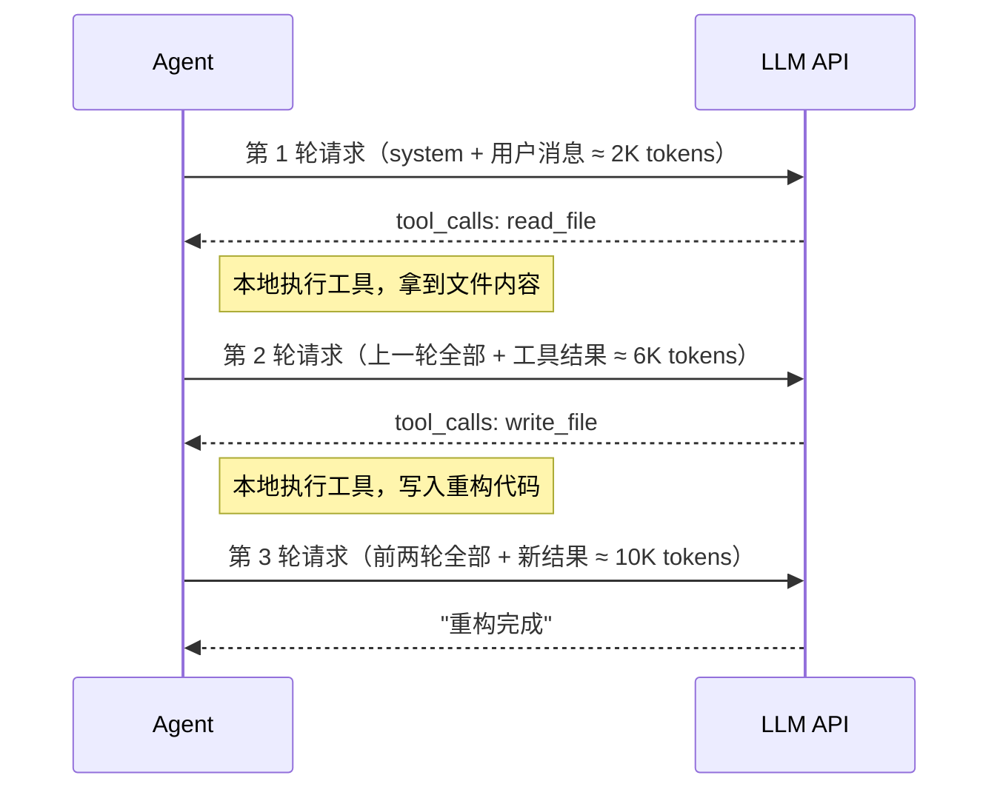
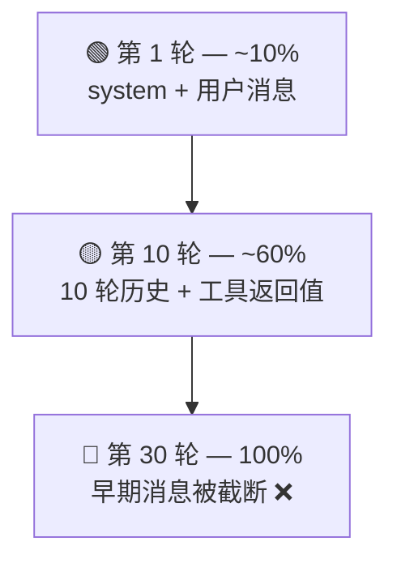
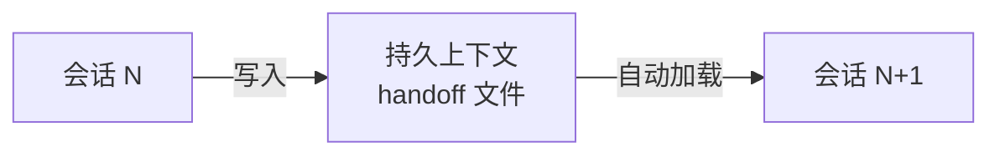
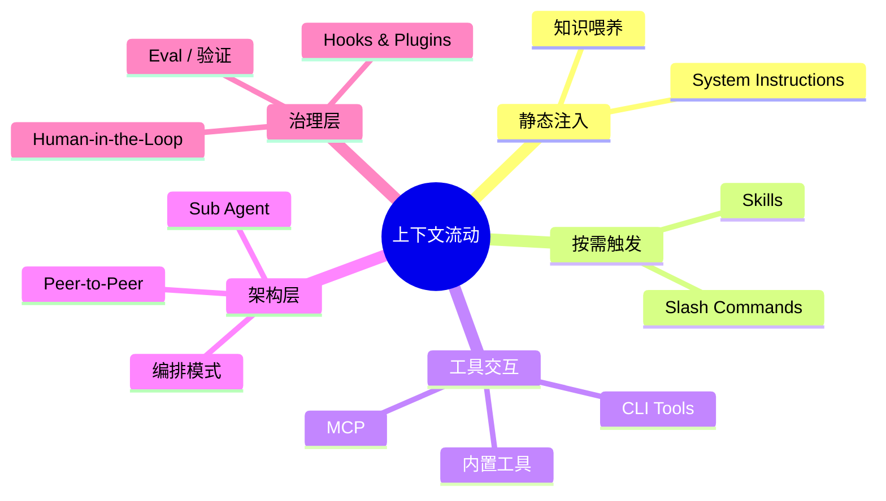

# 上下文 — 第一原则

> **上下文视角**：上下文本身就是第一原则 — LLM 的能力与限制都由上下文决定。

## 什么是上下文

你给 LLM 的一切，就是上下文。

LLM 每次处理请求时看到的**全部信息**——system prompt、对话历史、工具定义、工具返回值——统统算上，这就是上下文。

把这件事理解得再具体一点：看底层发生了什么。

### 请求与响应：上下文的实际样子

Agent 和 LLM 之间的通信是 HTTPS 请求。

不是一次请求搞定一切——是**多轮往返**，每轮都是一次完整的 request → response。

**── 第 1 轮 ──**

Agent 向 LLM API 发 POST 请求。请求体里的 `messages` 数组就是上下文：

```json
// → REQUEST（agent → LLM API）
{
  "system": "你是一个经验丰富的开发者。遵循项目编码规范...\n\n当前项目结构：\nsrc/processOrder.ts\nsrc/utils/\ntests/\npackage.json",
  "messages": [{ "role": "user", "content": "重构 processOrder，提取验证逻辑" }]
}
```

注意 system 里已经有项目结构了——Agent 在发请求之前扫描了目录树，把结果拼进了 system prompt。后面 LLM 能返回准确的文件路径，靠的就是这份上下文，不是凭空猜的。

LLM 通过 SSE（Server-Sent Events）流式返回响应——你看到文字逐字蹦出来，就是 SSE 流：

```json
// ← RESPONSE（LLM API → agent，SSE 流）
{
  "role": "assistant",
  "content": "我先读一下当前实现...",
  "tool_calls": [
    { "name": "read_file", "arguments": { "path": "src/processOrder.ts" } }
  ]
}
```

注意：LLM 没有直接给答案——它请求调用工具。Agent 在**本地**执行 `read_file`，拿到文件内容。**这一步不经过 LLM API。**

**── 第 2 轮 ──**

Agent 把上一轮的 LLM 响应和工具执行结果**追加到 `messages` 数组**，再次完整发出：

```json
// → REQUEST（agent → LLM API，注意 messages 比第 1 轮长了）
{
    "system": "你是一个经验丰富的开发者。遵循项目编码规范...\n\n当前项目结构：\nsrc/processOrder.ts\nsrc/utils/\ntests/\npackage.json",
    "messages": [
      { "role": "user", "content": "重构 processOrder，提取验证逻辑" },
    {
      "role": "assistant",
      "content": "我先读一下当前实现...",
      "tool_calls": [{ "name": "read_file", "arguments": "..." }]
    },
    {
      "role": "tool",
      "content": "export function processOrder(order) {\n  // 300 行混在一起的逻辑\n}"
    }
  ]
}
```

```json
// ← RESPONSE（LLM API → agent，SSE 流）
{
  "role": "assistant",
  "content": "看到了。验证逻辑可以提取为三个函数..."
}
```

第 2 轮请求**重发了第 1 轮的全部内容**——用户消息、LLM 上一次回复、工具调用结果。

**这就是上下文累积的本质：每一轮，`messages` 数组变长一点，然后整体重发。**



::: tip 不同 API，同一本质
Anthropic 的 Messages API、OpenAI 的 Chat Completions API、Google 的 Gemini API——格式各异，但核心结构一致：一个消息列表，逐轮追加，整体发送。你用的 agent 工具在底层都在做这件事。

OpenAI 后来推出了 Responses API，让开发者不用每次手动重发完整的 messages 数组——传一个 `previous_response_id` 就行，API 服务端帮你管理历史。但这是传输层的简化，不是模型层的改变。模型每次推理看到的仍然是完整的消息列表，上下文窗口的占用没变。
:::

## 为什么这是第一原则

**没有记忆**。

LLM 不是你的同事——昨天讨论的方案，今天不记得。甚至同一轮对话中，它也不是"记住"了你说的话。

它只是**每次把完整的消息列表重新读一遍**，然后推理。

这意味着所有 agent 工具——不管哪家的——做的核心工作只有一件事：

> **在正确的时机，把正确的信息，放进上下文。**

说白了——你的项目规则写得再好，agent 没把它读进上下文，就等于没写。代码没被索引到，它只能瞎猜。工具返回的数据质量直接决定下一步的质量——垃圾进，垃圾出。

**你遇到的绝大多数令人沮丧的问题**——生成的代码不符合规范、改了不该改的文件、忘了之前的约定——**归根结底是上下文问题。** 不是模型笨，是它没看到它需要看到的东西。

后续教程里讲的每一个机制——System Instructions、工具、MCP、Commands、Skills——**本质上都在回答同一组问题：放什么信息、什么时候放、怎么放进上下文。**

## 管好上下文

上下文不是越多越好。窗口大小有硬上限，信噪比决定推理质量，长对话还会自然退化。三件事分别展开。

### 窗口有限

每个 LLM 都有上下文窗口上限。128K、200K token——听起来很多，但 agentic 工作流中消耗速度远超直觉：

- System prompt + 全部工具定义就吃掉一大块
- 每轮对话的完整历史持续累积
- 工具返回值（文件内容、搜索结果、命令输出）动辄数千 token

窗口满了会怎样？早期消息被截断或压缩。Agent **字面意义上忘掉**你们最初讨论的需求——你以为它还记得，但那段消息已经不在 `messages` 数组里了。



### 噪声吞噬信号

窗口大小是硬限制。但即使没碰到上限，放进去的内容质量同样重要。

好的上下文管理是"检索正确的几十条关键事实"，不是"把所有文本一股脑灌进去"。目标是**只放 LLM 做决策真正需要的东西**——刚好够用，一句废话都不要。

给一个极聪明的陌生人递一整柜文件，说"相关的都在里面"。对方找得到一些，但也很可能被噪声带偏。

"够用"的标准是动态的，取决于你让 agent 干什么。

理解项目结构、梳理模块依赖？大上下文没问题，这类任务容忍模糊，宽一点反而能看到全貌。

改一个具体函数、修一个精确 bug？只给它需要的几个文件。做精确修改时，给的信息越多，反而越不准——LLM 的注意力被稀释，它会从不相关的文件里"借鉴"模式，抄错变量名，漏掉约束。

所以使用 agent 其实有两种不同的工作模式：

| 模式         | 任务类型               | 上下文策略                 |
| :----------- | :--------------------- | :------------------------- |
| **理解模式** | 梳理架构、理清依赖     | 放开——宽一点反而看得清全貌 |
| **修改模式** | 改具体函数、修精确 bug | 收紧——只给需要的几个文件   |

两种模式要根据当前任务切换。

亲手试一试：点击下面的按钮，看看一次完整的 Agent-LLM 交互中上下文是怎么一层层堆起来的。

<ContextBuilder />

上下文管理归结为四个动作：

- **写** — 生成有用信息
- **选** — 只挑相关的
- **压** — 精简到最小必要量
- **隔** — 不同任务给不同上下文切片

后续各节讲的工具和机制，都在帮你做这四件事。

写选压隔——帮你在**单步**层面管好上下文。但在**多步长对话**中，还有一个更隐蔽的问题。

<SvgIllustration name="context.svg" interactive />

### 上下文污染

长对话中，上下文逐渐"变脏"。早期探索的方案、被否决的尝试、错误的假设——不再相关，但仍留在消息历史中，持续影响 LLM 判断。

坏上下文比没上下文更危险。没上下文，LLM 知道自己不知道，至少会说"我需要更多信息"；给了过时或错误的上下文，它会把噪声当事实，自信地基于错误前提推理——你得到的不是"我不确定"，而是一个看起来合理、实际上跑偏的结果。

这解释了一个常见现象：对话初期 agent 又快又准，后半段开始犯匪夷所思的错误。不是模型变笨了，是上下文变脏了。

更隐蔽的污染是，早期错误在**持续带偏后续推理**。

举个具体场景：第 5 轮 LLM 错误地决定"用全局变量管理状态"。第 6 到第 14 轮，你们基于这个决定继续工作——它生成的代码、做的重构、给的建议，全都建立在"用全局变量"这个前提上。到第 15 轮你发现不对，说"别用全局变量，改成依赖注入"。

它短暂听话。但几轮后又滑回全局变量。

为什么？看看 `messages` 数组里发生了什么：你的纠正只有第 15 轮那一条消息。但第 5 到第 14 轮的**十条消息**——虽然没有哪条在重复说"用全局变量"——它们的代码、讨论、决策全都**隐含**了这个前提。LLM 从头读消息列表时，十条消息的隐含方向 vs 一条明确纠正，前者的惯性远大于后者。

```
// messages 数组里的实际状况
[
  msg 1-4:   正常讨论
  msg 5:     ❌ LLM 决定"用全局变量"
  msg 6-14:  基于这个决定写代码、重构、讨论  ← 9 条隐含同一前提
  msg 15:    ✅ 你说"改成依赖注入"            ← 就这 1 条
]
// 9 条隐含方向 vs 1 条明确纠正 → 惯性压过纠正
```

脏了怎么办？

回滚到干净节点。从源头限流，只给当前步骤需要的文件，别"以防万一"。

最有效的办法是开新会话。但别复制聊天记录。只提炼值得保留的部分：已确认的事实、定好的方案、验收标准。压成干净输入，只带这个继续。弯路留在旧会话。

为什么建议自己提炼？多数工具的自动压缩不透明——你不知道什么被留下、什么被丢。有些工具提供了[压缩 hook](./hooks-and-plugins.md) 让你控制保留策略，能缓解这个问题。但主动提炼有一个自动压缩给不了的好处：提炼过程本身就在帮你梳理思路。

加法决定 agent 看到什么，减法决定它不被什么淹没。

还有一条实操原则：把最重要的约束放在对话的开头和结尾。

模型对中间段的注意力最弱——研究者叫这个"lost-in-the-middle"。你的核心规则如果埋在第 50 条消息里，大概率会被忽略。

## State & Memory

为什么 agent 会"忘事"？

因为它根本没有记忆。它有的是**会话状态**——当前对话中累积的消息列表。

你的项目规则文件每次新对话都生效。编码约定每次都重新生效。这不是记忆。这是**持久上下文**——agent 在每次新会话开始时主动读取这些文件，重新注入 `messages` 数组。看起来像记忆，实际上是每次重新加载。

|          | 会话状态             | 持久上下文                   |
| -------- | -------------------- | ---------------------------- |
| 生命周期 | 随对话结束消失       | 跨会话存在                   |
| 存储     | 内存中的消息列表     | 文件系统上的文件             |
| 维护者   | Agent 自动管理       | 你主导，工具辅助             |
| 典型内容 | 对话历史、工具返回值 | 项目规范、架构决策、编码约定 |

比如：你在对话中让 agent 读了 `package.json` 的内容——这是会话状态，对话结束就没了。你在项目根目录放一份指令文件（不同工具叫法不同——`AGENTS.md`、`.cursorrules`、`CLAUDE.md` 等），规定"所有函数必须有 JSDoc 注释"——这是持久上下文，每次新对话 agent 都会读到它。

### 上下文的保鲜期

上下文有保鲜期——放久了会变质。

一个跑了几百轮工具调用的超长会话，上下文质量几乎必然退化。早期关键信息被挤到窗口边缘甚至已被截断，中间积累大量过时的中间状态，后期推理建立在一片噪声之上。

**什么时候该开新对话？** 当 agent 开始"忘"早期约定、重复犯已经纠正过的错误、行为变得飘忽——上下文变质了。重新开始，让 agent 从干净的持久上下文出发。这远比在被污染的对话里反复纠偏高效。

### Session Handoff

结束会话前，把关键决策、中间产出和下一步计划写入持久上下文——项目规则文件、handoff 文件、或者任何 agent 下次启动时会读取的位置。

什么最容易丢？不是"改了什么"——git 有记录。最容易丢的是**"为什么这么改"**。

比如：你决定用方案 X 而不用方案 Y，原因是 Y 在高并发下有竞争条件。这个决策逻辑不会出现在 diff 里。下一个会话的 agent 能看到代码长什么样，但不知道为什么长这样——于是它可能建议你改回方案 Y。

所以 handoff 的核心不是"记住"，而是**显式传递**：把值得保留的决策逻辑和上下文，写进下一次会话的初始输入里。



### 长期记忆

Session Handoff 解决"这次到下次"的传递。但更远的记忆呢？

有些 Agent 工具提供了跨会话的自动记忆功能。它会把多次会话中的关键发现、偏好、决策自动积累下来，下次启动时检索相关的部分注入上下文。

但它不是长期记忆。它只是**自动化的持久上下文**。写入和检索是自动的，存储介质仍然是文件或数据库，注入时机仍然是会话开始时。本质没变，自动化程度变了。

记住两件事就够了：

- **会话内**（session state）是短期的，对话结束就没了。你手动维护或 Agent 自动管理。
- **跨会话**（persistent context）是长期的，靠文件系统或专用存储。你主动写的（项目规则、handoff 文件）或 Agent 自动积累的（记忆功能），都属此类。

第二类听起来很方便，但有个坑：自动积累的内容你不一定看得到。Agent 记住了一个后来被推翻的决策——过一段时间后，它基于这条过时记忆给了一个看起来合理、实际错误的建议。过时的记忆和过时的文档一样危险。甚至更危险，因为你可能根本不知道那条记忆还在。

## 前瞻：后续各节的上下文载体

上下文是第一原则。但"怎么把信息放进上下文"有很多种方式，每种适合不同场景。

后续每一节讲的都是上下文的一种载体：

| 载体                   | 上下文角色                           |
| ---------------------- | ------------------------------------ |
| System Instructions    | LLM 收到的第一份上下文，默认存在     |
| 内置工具               | 工具定义 + 返回值 = 上下文           |
| MCP                    | 外部能力扩展，同样进入上下文         |
| Slash Commands         | 按需触发的上下文注入                 |
| Skills                 | 动态加载的领域知识                   |
| Agent-Native CLI Tools | 外部工具输出直接成为上下文           |
| 知识喂养               | 把你知道的变成 agent 知道的          |
| 编排模式               | 上下文如何在多步骤间流动、分裂、汇合 |
| Sub Agent              | 创造全新上下文（隔离）               |
| Eval / 验证            | 验证结果 = 反馈上下文                |
| Human-in-the-Loop      | 人决定上下文的最终走向               |
| Peer-to-Peer Agents    | 上下文在平级 agent 之间双向流动      |

一条主线贯穿始终：**上下文如何流动。**



## 本节小结

- **上下文流动**：这节的上下文从 system prompt 开始。后续每一节都在往里加东西——注入方式不同，但最终都落进 `messages` 数组。
- **风险**：搞错上下文边界，偏差像滚雪球——从这一步传到每一步。
- **可审计性**：好消息——每次 HTTP 请求的完整 `messages` 数组就是日志。出了问题，从头重放。

下一节拆开三方角色——你、Agent、LLM——看上下文在它们之间怎么流转。
