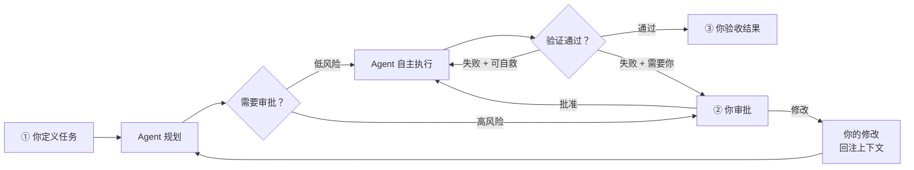

# Human-in-the-Loop：你才是最终决策者

> **上下文视角**：你的每次批准、拒绝、修改，都会改写下一轮上下文，从而改变 Agent 的行为。你不只是在审批——你在塑造 Agent 的决策路径。

上一节讲了验证机制——机器能自己判断对不对。但有些事机器判断不了：该不该 push 到 production？这个重构方向对不对？删除这批数据真的没问题吗？

这些需要你来拍板。

## 一个理想与现实

理想状态：你表达意图，Agent 完成一切，你验收结果。中间零介入。

现实：Agent 会犯错、会卡住、会在高风险操作前需要你确认。你的介入是安全网。

但这里有个重要洞察：**如果你发现自己不断在修 Agent 的半成品，这不是"协作"——这是 Agent（或你的指令）出了问题。** 健康的 Human-in-the-Loop 是你的介入越来越少，而不是越来越多。每次介入都应该是一个信号：要么提升 Agent 的配置（更好的 System Instructions、更清晰的指令），要么接受当前能力边界。

<SvgIllustration name="human-in-the-loop.svg" interactive />

## 铺轨策略

觉得累？多半是你把 Agent 当全自动驾驶，自己又时刻握着方向盘。

更轻松的模式：**先铺轨，再发车。**

- **你铺轨**：项目骨架、测试用例、API 接口。结构性的、高上下文的活。
- **Agent 跑车**：填空、实现函数、通过测试。消耗性的、低上下文的活。

轨道限制了跑偏幅度。测试用例就是护栏。

## 你在流程中的三个位置

1. **输入端：定义任务。** 你给出意图、提供背景、定义什么叫"完成"。这是你对上下文的第一次注入——指令质量直接决定后续一切。

2. **中间：关键决策点。** Agent 遇到高风险操作时暂停，等你确认。你的决策（批准/修改/拒绝）回注入上下文，改写 Agent 的下一步行为。

3. **输出端：结果验收。** Agent 说"搞定了"，你确认是否真的搞定。对于低风险任务，这一步可以跳过；对于高风险任务，这是最后一道关。

每个位置的道理都一样：**你的决策 → 上下文变化 → Agent 行为改变。**

## 放手 vs. 介入

不是所有任务都需要你盯着。判断标准不是感觉，是风险评估。

| 风险级别 | 任务特征 | 你的策略 | 示例 |
|:---|---|---|---|
| **低风险 / 可逆** | 影响范围小，易回滚，验证成本低 | **放手** | 生成单元测试、重构纯函数、写文档初稿 |
| **中风险 / 可控** | 涉及多文件，有版本控制 | **抽查** | 添加新特性、修改 API、升级依赖 |
| **高风险 / 不可逆** | 操作生产环境、删除数据、对外发布 | **强制审批** | 数据库迁移、`git push --force`、部署生产 |

三个硬触发器——无论你多信任 Agent，以下操作**必须**人工确认：

- **对外写操作**：`git push`、发布 npm 包、部署网站
- **不可逆操作**：删除文件、`git reset --hard`、清理数据库
- **高成本操作**：昂贵的 API 调用、大规模 CI/CD 流程

部分 Agent 工具会在这些操作前自动暂停并展示 diff。如果你的工具没有这个功能，在 System Instructions 里写明："执行以下操作前必须先请求确认。"

## 纠偏策略

Agent 跑偏时，你有三条路：

| 策略 | 什么时候用 | 理由 |
| :--- | :--- | :--- |
| **立即打断** | 从一开始就理解错了意图，或正在执行明显错误操作 | 越早打断，沉没成本越低 |
| **让它跑完再改** | 整体方向对，但细节有瑕疵 | 保留大部分工作成果，只修正细节 |
| **放弃重来** | 上下文已严重污染，Agent 陷入无法恢复的混乱 | 干净会话 + 清晰指令 > 泥潭里挣扎 |

怎么选？问自己：继续下去的预期收益，是否大于从零开始的成本？

## 认知债务

一个隐蔽但严重的风险：**过度委托导致你对系统的理解被稀释。**

代码是 Agent 写的，Bug 是 Agent 修的，架构是 Agent 调整的——几个月后，你可能已经说不清某些模块的工作原理了。这不是技术债，是**认知债**。负债的不是代码，是你的大脑。

怎么发现自己在积累认知债？几个症状：

- 有人问你某个模块怎么工作，你需要让 Agent 给你解释
- Code review 的时间越来越短——因为你已经"看不懂"了，只能信任 Agent
- 出了故障，你第一反应不是自己排查，而是让 Agent 来定位

团队里这个问题更严重。每个人各自委托 Agent 做不同模块，过一段时间后，很难有人完整说清整个系统的全貌。不是代码丢了——代码都在 git 里。丢的是团队对代码库的共享理解。

缓解方式：

- **认真 review Agent 的提交**——像 review 同事的代码一样
- **核心模块自己动手**，或者跟 Agent 结对编程
- **定期画架构图**——让 Agent 生成也行，但你必须看懂并确认

Agent 能帮你做更多事。但如果你对代码库的理解掉队了，产出的质量你根本把不住关。

<SvgIllustration name="human-in-the-loop-inline-1.svg" interactive />

还有一个方向相反但同样危险的滑坡：审批疲劳。Agent 每次高风险操作前都暂停等你确认，反复弹确认，你的注意力先于意愿垮掉——从"认真看 diff"滑到"条件反射点确认"。缓解方式和上面的"放手 vs. 介入"一样：低风险的别弹，把审批预算留给真正需要你判断的操作。

## 本节小结

- **上下文流动**：你的每次决策（批准、拒绝、修改）都是一次上下文注入。Agent 的产出是你决策的输入，你的决策是 Agent 下一轮推理的输入。这是整个教程里唯一的双向闭环——人和 Agent 互为上下文。
- **风险**：两个方向都危险。过度信任导致认知债务累积和失控；审批疲劳导致你对 Agent 的请求不假思索一路绿灯——跟不审批没区别。
- **可审计性**：你做出的每次介入——批准了什么、拒绝了什么、改了什么——都应该被记录。这不只是追溯问题的依据，也是你复盘"我和 Agent 的协作模式是否健康"的数据源。

下一节是最后一站：Peer-to-Peer Agents。到目前为止，人类始终是上下文的最终仲裁者——但当多个 Agent 开始平级协作时，上下文的流动会变得更复杂。

