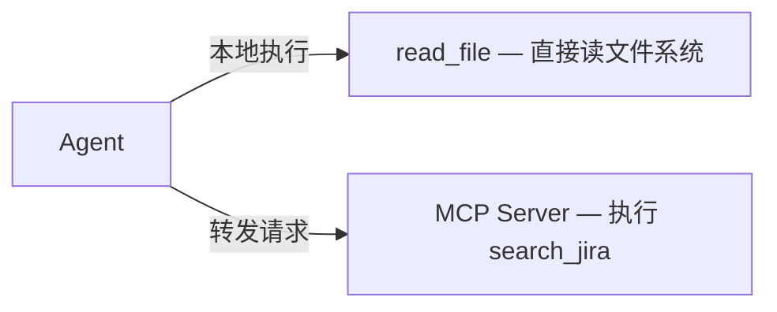

# MCP — 外部能力扩展

> **上下文视角**：MCP 工具的定义和返回值与内置工具一样进入上下文，LLM 不区分来源。

上一节的内置工具都在本地执行——读文件、跑命令，Agent 直接搞定。但如果你想让 Agent 查 Jira ticket、搜 Slack 消息、调公司内部 API 呢？

等 Agent 开发者更新？不现实。自己改源码？更不现实。

你需要一个标准接口，让**任何外部能力**都能接入 Agent。这就是 MCP（Model Context Protocol）。

## 什么是 MCP？

一句话：**Agent 世界的 USB 接口。**

MCP 是一个开放协议。它规定了一套标准，允许任何人为 Agent 开发工具，无需修改 Agent 本身的代码。就像 USB 设备不需要了解电脑内部构造，一个 MCP 工具不需要了解 Agent 的实现细节。

Agent 在运行时动态发现并加载这些外部工具。你只需要配一下，不需要写代码。

## Server 与 Client

这两个词容易让人困惑。先澄清一个常见误解：**MCP Server 不一定是远程服务器。**

- **MCP Client**：运行在 Agent 内部的组件，负责发现、连接和调用 MCP Server 上的工具。你通常不直接操作它。
- **MCP Server**：提供工具的那一方。它可以是一个本地进程，也可以是一个远程 HTTP 服务。

你会遇到各种 MCP Server。举几个真实例子：Context7（文档查询）、Tavily/Exa（搜索引擎）、DeepWiki（代码仓库文档）、Firecrawl（网页抓取）、Grep.app（GitHub 代码搜索）。其中一部分通过 stdio 跑在你本地（如 Context7、Firecrawl），另一部分作为远程 HTTP 服务运行（如 Exa、DeepWiki、Tavily）。

### 两种传输方式

MCP 支持两种连接方式：

**stdio（本地子进程）**：Agent 直接 spawn 一个子进程来运行 MCP Server。通信走 stdin/stdout，Agent 管理这个进程的整个生命周期——启动、通信、关闭。你在配置文件里写 `command: "npx", args: ["-y", "@modelcontextprotocol/server-postgres"]`，背后就是这个机制。

**Streamable HTTP（远程服务）**：MCP Server 作为独立的 HTTP 服务运行，Agent 通过 HTTP 请求连接。适合需要持久运行或多个 Agent 共享的场景。

对你来说，区别只在配置方式。对 LLM 来说，完全不知道也不关心。

## 功能等价，来源不同

这是关键：对 LLM 来说，内置工具和 MCP 工具**毫无区别**。

**── 第 1 轮 ──**

假设有一个通过 MCP 接入的 `search_jira` 工具。用户提问时，Agent 把**所有可用工具**（内置 + MCP）的定义一起放进上下文：

```json
// → REQUEST（agent → LLM API）
{
  "system": "你是一个项目助理...",
  "tools": [
    {
      "name": "read_file",
      "description": "读取文件内容",
      "input_schema": { "...": "..." }
    },
    {
      "name": "search_jira",
      "description": "根据关键词搜索 Jira issue",
      "input_schema": { "...": "..." }
    }
  ],
  "messages": [{ "role": "user", "content": "查一下"数据库性能"相关的 ticket" }]
}
```

LLM 选择最合适的工具：

```json
// ← RESPONSE（LLM API → agent，SSE 流）
{
  "role": "assistant",
  "content": "好的，正在搜索 Jira...",
  "tool_calls": [
    { "id": "call_xyz789", "name": "search_jira", "arguments": { "query": "数据库性能" } }
  ]
}
```

LLM 视角：和调用 `read_file` 完全一样，就是返回一个 `tool_calls`。

Agent 视角：执行路径不同。



**── 第 2 轮 ──**

MCP Server 返回结果后，Agent 把它包装成 `tool` 角色消息，追加到对话历史。和内置工具的返回值格式一模一样：

```json
// → REQUEST（agent → LLM API）
{
  "messages": [
    // ... 之前的消息
    {
      "role": "tool",
      "tool_call_id": "call_xyz789",
      "content": "[{\"id\": \"PROJ-123\", \"title\": \"优化数据库索引\"}, {\"id\": \"PROJ-456\", \"title\": \"慢查询排查\"}]"
    }
  ]
}
```

```json
// ← RESPONSE（LLM API → agent，SSE 流）
{
  "role": "assistant",
  "content": "找到两个相关 ticket：\n1. PROJ-123 — 优化数据库索引\n2. PROJ-456 — 慢查询排查\n\n需要我查看某个 ticket 的详情吗？"
}
```

LLM 只关心拿到了搜索结果。它不知道也不需要知道这个结果来自本地还是远端。

一句话总结：**LLM 层完全等价，Agent 执行层路径不同。**

## 为什么重要

MCP 的价值不在"又多了一个协议"，而在于**解除你对 Agent 开发者的依赖**：

- **不等官方更新**：想接 Jira？装个 MCP Server 就行，不需要等 Agent 下个版本。
- **快接内部系统**：公司内部 API 永远不会被官方支持，但你可以自己写（或找现成的）MCP Server。
- **跨 Agent 复用**：一个 MCP Server 理论上能被任何支持该协议的 Agent 使用——不绑定特定工具。

## 读每一节时，留意这三件事

- **上下文流动**：MCP 工具定义在每次请求时注入上下文（静态），返回值在执行后追加（动态）。和内置工具走同一条上下文通道——LLM 感知不到区别。
- **风险**：MCP 的信任问题比内置工具更尖锐。恶意 MCP Server 可能返回虚假数据污染上下文，或记录你的敏感请求。装 MCP Server 和装浏览器插件一样——来源可信吗？权限合理吗？
- **可审计性**：Agent 与 MCP Server 之间的每次交互都应该被记录——请求了什么、返回了什么、耗时多少。出了问题，这就是你的排查线索。

下一节看 Slash Commands——如何把常用操作打包成一键触发的快捷方式。
