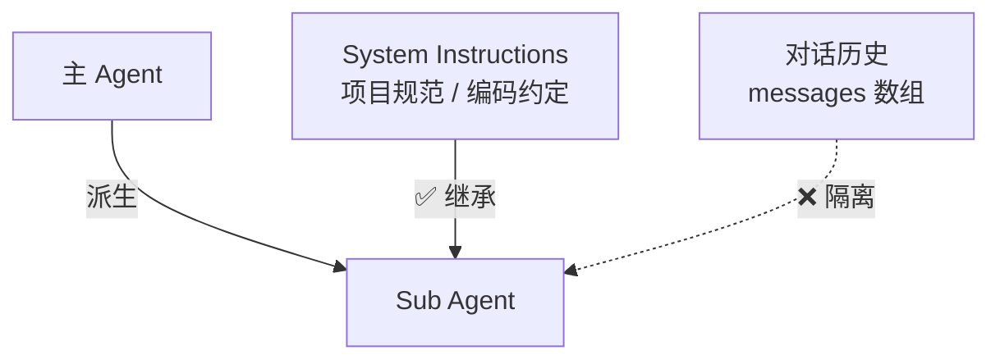

# 子代理 — 上下文隔离

> **上下文视角**：Sub Agent 通过创建一份隔离的上下文来解决特定子任务，避免主上下文被污染。

上一节讲了编排模式——怎么组织步骤。这一节看执行单元：当主 Agent 需要一个干净的环境来处理子任务时，它会派生出 Sub Agent。

<SvgIllustration name="sub-agents.svg" interactive />

## 问题：上下文越来越脏

还记得[第一原则](./context.md)里的"上下文污染"吗？

对话持续越久，`messages` 数组越长。早期的探索、被否决的方案、不相关的工具输出……全堆在里面。当你让 Agent 在这堆噪声中执行一个精确的子任务——比如"基于最新的 API schema 写一段集成测试"——LLM 的注意力被稀释，可能参考到过时的代码，或者遵循已废弃的约定。

你需要一个干净的房间。

不过先停一下——并非所有任务都需要这个干净的房间。单步触发一次 [Command](./commands.md) 够用？那就用它，更轻量。需要一直遵守的规矩？[Skill](./skills.md) 加载一次即可。子任务足够独立、目标明确？直接派生 Sub Agent——不用等到上下文变脏才考虑。

## 派生 Sub Agent

Sub Agent 就是这个干净的房间。

主 Agent 可以派生一个或多个 Sub Agent。每个 Sub Agent 的 `messages` 历史**从零开始**——它看不到主 Agent 跟你聊了什么。但"干净"不等于"空白"：Sub Agent 通常会继承主 Agent 的 System Instructions。你在 CLAUDE.md 里写的项目规范、编码约定、安全护栏——Sub Agent 一样遵守。

隔离的是对话历史，不是项目规则。



还有一点容易忽略：**Sub Agent 的初始 prompt 通常是主 Agent 自动构造的。** 你给主 Agent 一个大任务，主 Agent 分析后自己决定"这个子任务需要独立处理"，然后构造一份初始 prompt 发给 Sub Agent。你可以通过 System Instructions 告诉主 Agent 怎么构造这份 prompt——比如"委派时必须包含文件路径和约束条件"。你的指令越精准，主 Agent 构造的 prompt 就越好。

## 好的初始 prompt 长什么样

派活给 Sub Agent，最常见的错误：把所有聊天记录扔给它。

正确做法——给一份精简的任务描述，只含三样：

1. **目标**：具体。"修复 auth 模块的登录 bug。"
2. **约束**："不动数据库 schema。不引入新依赖。"
3. **关键上下文**："相关文件是 A 和 B。错误日志在 C。"

其余历史不要。倾倒上下文是偷懒，Sub Agent 会在噪声中迷失。

<SvgIllustration name="sub-agents-inline-1.svg" interactive />

## 工作方式

主 Agent 委派任务给 Sub Agent，可以看作三步：

<SvgIllustration name="sub-agents-inline-3.svg" interactive />

**── Sub Agent 内部 ──**

Sub Agent 的 `messages` 从零开始，但 system prompt 继承了项目的 System Instructions：

**第 1 轮：接收任务**

```json
// → REQUEST (Sub Agent → LLM API)
{
  "system": "你是一个代码助手。\n\n[项目 System Instructions]\n- TypeScript strict mode\n- 测试用 Vitest\n- 禁止 any 类型\n...",
  "messages": [
    {
      "role": "user",
      "content": "你是一个 QA 工程师。这是 API schema 文件：{...}\n为 createUser endpoint 编写集成测试..."
    }
  ]
}
```

注意 `messages` 只有一条——干净、聚焦，没有主 Agent 的历史包袱。

**第 2 轮：工具调用后，上下文增长**

Sub Agent 读完 schema、写了测试文件、跑了一次测试发现报错，于是修正：

```json
// → REQUEST (Sub Agent → LLM API, 第 2 轮)
{
  "system": "（同上，不变）",
  "messages": [
    { "role": "user", "content": "你是一个 QA 工程师..." },
    {
      "role": "assistant",
      "content": "我先读取 schema 文件...",
      "tool_calls": [
        {
          "name": "read_file",
          "arguments": { "path": "src/api/v2/schema.json" }
        }
      ]
    },
    {
      "role": "tool",
      "content": "{ \"endpoints\": { \"createUser\": { ... } } }"
    },
    {
      "role": "assistant",
      "content": "Schema 已读取。现在编写测试...",
      "tool_calls": [
        {
          "name": "write_file",
          "arguments": {
            "path": "tests/integration/createUser.test.ts",
            "content": "..."
          }
        }
      ]
    },
    { "role": "tool", "content": "文件已写入。" },
    {
      "role": "assistant",
      "content": "运行测试验证...",
      "tool_calls": [
        { "name": "bash", "arguments": { "command": "vitest run createUser" } }
      ]
    },
    { "role": "tool", "content": "FAIL: expected 201 but got 500..." },
    {
      "role": "assistant",
      "content": "测试失败，500 错误。检查 endpoint 实现后发现缺少数据库连接配置。修正测试 mock..."
    }
  ]
}
```

Sub Agent 内部可能经历十几轮工具调用——读规范、写代码、跑测试、修 bug。**这一切都发生在隔离上下文中，主 Agent 看不见，也不受干扰。**

**最终返回**

Sub Agent 完成后，返回一份**摘要**给主 Agent——不是几十条完整消息历史，而是压缩后的结果。这就像 `git stash`：暂存当前复杂上下文，在干净分支上做完一个原子任务，带着产出切回来。

主 Agent 拿到的只是："测试已创建，覆盖 201 和 400，文件在 `tests/integration/createUser.test.ts`"。至于 Sub Agent 中间经历了什么挣扎，主 Agent 不需要知道。

<SvgIllustration name="sub-agents-inline-2.svg" interactive />

## 回到第一原则

Sub Agent 的表现，取决于两件事：

1. **System Instructions 的质量**：你在 CLAUDE.md 里写的项目规则，Sub Agent 也吃。规则写得好，Sub Agent 的行为就符合项目规范。这就是[知识喂养](./knowledge-feeding.md)的规则层在 Sub Agent 上的体现。

2. **主 Agent 构造的初始 prompt 的质量**：这又回到[第一原则](./context.md)——上下文质量决定输出质量。好的初始 prompt 必须是：
   - **独立的**：不依赖主上下文中的隐含信息。
   - **完备的**：包含执行所需的所有背景材料（代码片段、文件路径、明确目标）。
   - **聚焦的**：只含跟子任务相关的信息，不带噪声。

你能做的：给主 Agent 清晰的指令和充足的背景信息。主 Agent 构造 prompt 的原料越好，Sub Agent 的表现就越好。

## 本节小结

- **上下文流动**：主 Agent 从自己的上下文中提取信息，构造初始 prompt → Sub Agent 在隔离上下文中独立执行 → 完成后返回摘要，回注主 Agent 上下文。运行时隔离，但日志完整保留——两者不冲突。
- **风险**：隔离是双刃剑。如果主 Agent 构造 prompt 时遗漏了关键约束，Sub Agent 会在缺少关键信息的情况下干活，产出不合规的代码。过度拆分也有成本——每个 Sub Agent 都要重新建立上下文，协调开销会累积。
- **可审计性**：Sub Agent 的完整会话记录独立保存，可追溯。当摘要有问题时，你可以下钻到 Sub Agent 的完整上下文排查根因。摘要是压缩，不是真相——下一节看怎么验证。

下一节看验证与可观测性——Sub Agent 返回的摘要可靠吗？Agent 的每一步输出，都需要验证机制来兜底。
